# US Stock Realtime Chart — システム／インフラアーキテクチャ

> 対象リポジトリ: `makechair/us-stock-realtime-chart`
> 調査基準: 2026-07-30 / RESTポーリングを生存経路とした構成
> 調査方法: アプリケーション、systemd、Terraform、GitHub Actions、バックアップ
> スクリプトのコード照合に加え、稼働中インスタンスでの実測（WebSocket無配信、
> 被覆率、価格差、REST消費）を突き合わせた
> 注意: Terraform 管理外の手動設定（Cloudflare Tunnel／Access／DNS）は未検証である。
> 追記: 2026-07-31 に定量分析用の日足コーパス（Phase 1）とNotionニュースコーパス
> （Phase 2）を実装し、本書19節へREST予算共有、差分同期、S3確定フローを追加した。
> Phase 3のイベントスタディは日次履歴、前回比較JSON、認証付きAPI／閲覧UIまで
> 実装し、systemd timer、初回分析、S3保存まで本番確認済み。

> **2026-07-29 の前提変更:** 仕様書が構成全体の土台に置いていた「WebSocket で常時
> 受信し1秒ごとに更新する」が、Tiingo・Alpaca いずれの無料枠でも成立しないことが
> 実測で判明した（`docs/spec-review.md` A-6）。本書はこの発見を反映し、
> **REST ポーリングを生存経路として**記述している。WebSocket 経路のコードは
> 削除しておらず、有料枠へ移れば設定変更だけで実線に戻る。

## 1. エグゼクティブサマリー

このシステムは、個人が保有・監視する最大10銘柄の米国株について、約定データから
1分足を生成し、認証済みブラウザへリアルタイム配信する小規模な常時稼働システムである。

中心となる設計判断は次のとおり。

| 観点 | 実装 |
|---|---|
| 市場データ | Tiingo を主系、Alpaca IEX を手動切替の待機系、開発時は Mock |
| 収集 | 独立した Python `asyncio` プロセスが **REST で1分足をポーリング**（WebSocket も張るが無料枠では無音） |
| 予算配分 | `symbols.last_viewed_at` を手がかりに、50 calls/hour を**画面に出ている1銘柄**へ寄せる |
| 銘柄検索 | watchlist → ローカル `symbol_catalog` → provider の3段。provider 段だけが枠を消費する |
| 永続化 | SQLite WAL の `market.db`。時系列は collector が単独で書く |
| ライブ共有 | tmpfs 上の別 SQLite `live.db`。collector が書き、API が読む（ストリーム休止中は status のみ） |
| API／画面 | FastAPI + SSE + ビルド不要の静的 JavaScript。画面は30秒ごとにローカルDBから差分を取る |
| 外部公開 | Cloudflare Tunnel。Lightsail の 80/443 は公開しない |
| 認証 | Cloudflare Access とアプリ内 JWT 検証の二重ゲート |
| 実行基盤 | Amazon Lightsail 2GB、collector/API/cloudflaredをsystemdで直接起動 |
| IaC | Terraform。Lightsail、S3、IAM、SNS、CloudWatch、Budgets を管理 |
| CI | GitHub Actions でテスト、lint、Terraform validate/apply |
| CD | Lightsail 上の systemd timer が `main` を2分間隔で pull |
| バックアップ | SQLite 整合コピーを gzip 化し、S3 Standard-IA へ日次保管 |
| 分析コーパス | Tiingo調整済み日足とNotionニュースをParquet化し、同じS3へ保管 |

システム全体は「単一ホスト・単一リージョン・単一SQLite」という意図的に小さな構成で、
Redis、メッセージブローカー、ロードバランサー、マネージドDBを追加せず、月額コストと
運用複雑性を抑えている。その代わり、Lightsail インスタンスとローカルDBは単一障害点であり、
復旧は日次バックアップ、Lightsail スナップショット、プロバイダーREST補完を組み合わせる。

## 2. なぜこれで動くのか

この構成の非自明な点はひとつに集約される。**1時間に50回しか外部を叩けないのに、
画面のチャートは数分おきに伸びていく。** 成立させているのは次の3つで、どれか1つでも
欠けると成り立たない。

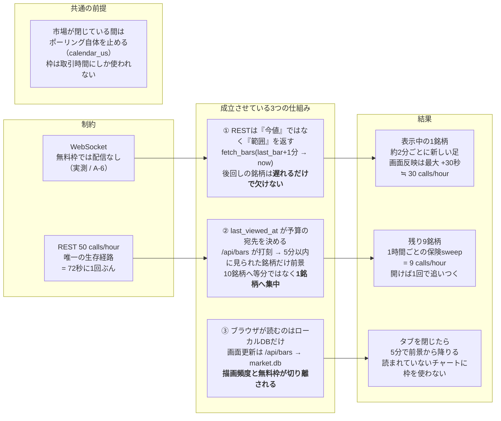

### 2.1 3つの仕組みの中身

**① REST は「点」ではなく「範囲」を返す。**
`fetch_bars(symbol, last_bar + 1分, now)` は、その間の全ての1分足をまとめて返す。
つまり**後回しにした銘柄は、遅れるだけで欠けない**。1時間放置した銘柄も、開いた瞬間の
1回の呼び出しで完全に埋まる。もし REST が「現在値のスナップショット」しか返さないAPIなら、
呼ばなかった時間はそのまま永久に失われるので、予算を偏らせる設計そのものが成立しない。

**② `last_viewed_at` が予算の宛先を決める。**
`/api/bars/{symbol}` は呼ばれるたびに `symbols.last_viewed_at` を打刻する
（`0003_symbol_viewing.sql`）。collector は既に数秒ごとに `symbols` を読んで購読変更を
検出しているので、そこへ相乗りするだけで済み、2プロセス間に新しいIPCを足さずに
「いまどれが見られているか」を知れる。50回を10銘柄へ等分すれば12分に1回だが、
1銘柄へ寄せれば72秒に1回ぶんになる。

**③ ブラウザが読むのはローカルDBだけ。**
画面の更新は `/api/bars` → `market.db` であって、provider へは届かない。だから
**描画頻度と無料枠は完全に無関係**である。ブラウザは30秒ごとに「まだ描いていない分」
（`?start=最新足のtimestamp`）だけを取りに行く。この繰り返しの要求が、同時に
②の打刻を維持する唯一の仕組みでもある。

### 2.2 実際の消費量（10銘柄・取引時間中）

鮮度を決めているのは `USSTOCKS_FOREGROUND_POLL_SECONDS` だけではない。
`backfill_min_gap_seconds`（既定120秒）が「その程度の隙間に REST 枠を使う価値はない」
として要求を捨てるため、**前景の実効間隔は90秒設定でも約2分になる**。

| 用途 | 設定 | 実効間隔 | calls / hour |
|---|---|---|---:|
| 前景（表示中の1銘柄） | `foreground_poll_seconds=90` | 約2分（min_gap 120秒に律速） | 約30 |
| 保険sweep（残り9銘柄） | `background_poll_seconds=3600` | 1時間 | 9 |
| 再接続／起動時backfill | 都度 | — | 数回 |
| 銘柄検索 | catalogに無い語のみ | — | ほぼ0 |
| **合計** | | | **約39 / 上限50** |

現在は履歴コーパスと再接続backfillのため、通常時に約11 calls/hourの余白を確保している。
`min_gap` を下げて前景を本当に90秒間隔にすると、前景40 + 保険sweep 9 =
49 calls/hourとなり、起動時backfillや検索を含める余地がほぼなくなる。鮮度を上げる場合は
銘柄数を減らすか、有料枠へ移る必要がある。

なお、poll loop は市場が閉じている間は何もしない（`has_open_window`）。1時間あたりの枠は
取引時間のあいだにしか使われないので、寄り付き直後の再接続バックフィルや、
検索が provider へ抜けたときの余地はここから出ている。

### 2.3 いま流れている経路と、休止している経路

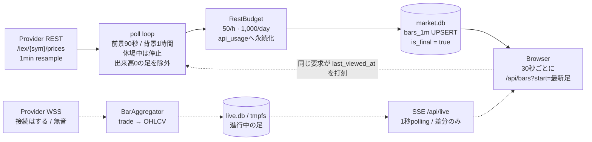

実線がいま流れている経路、破線が接続はするがデータの来ない経路である。SSE 経路は
削除していない。`USSTOCKS_PRIMARY_SOURCE` と有料プランを変えるだけで実線へ戻るため、
収集・集約・配信のコードはそのまま残してある。現在 SSE が運んでいるのは、
起動時の snapshot と collector status、そして15秒ごとの heartbeat だけである。

### 2.4 この構成が引き受けている限界

| 限界 | 内容 |
|---|---|
| 秒単位のローソク | **不可能。** 1分足を数分おきに取るのが上限。1秒ごとの伸縮には配信されるストリームが要る |
| 出来高の絶対値 | IEX 単独のため統合気配より2〜3桁小さい。他の板と比較できない |
| 閑散銘柄・時間外 | 足が飛び飛びになる。AAPL の通常取引では385/390本＝**98.7%**だが、薄い銘柄では大きく落ちる |
| 価格の正確さ | **問題ない。** 証券会社アプリとの差は 0.08%（MU 826.93 対 826.23、同一時刻の実測） |
| 銘柄数 | 10本が上限。増やすと保険sweepが枠を食い、前景の鮮度が落ちる |

## 3. 実装範囲と責任境界

### 3.1 リポジトリで実装されているもの

- Tiingo／Alpaca／Mock の市場データアダプター（REST・WebSocket 両方）
- 約定から1分足を生成する collector
- **表示中の銘柄を狙う REST ポーリング**（`_poll_loop`）と市場カレンダー連動
- 再接続、指数バックオフ、ジッター、欠損REST補完、429 の再queue
- 永続REST利用枠と月間受信帯域メーター
- **週次 ticker catalog import とローカル優先の3段検索**
- SQLite スキーマ、マイグレーション3本、ソース優先解決
- FastAPI の履歴、ライブ、銘柄、検索、CSV／Parquet、ヘルスAPI
- Cloudflare Access JWT のアプリ内検証
- Lightweight Charts を使う静的フロントエンド（タイムゾーン選択、移動平均、
  表示状態の永続化、30秒ごとの差分取得）
- Docker イメージと3サービスの Compose 構成
- systemd の実行ユニット、デプロイ／バックアップ／catalog の各timer
- AWS Terraform、GitHub OIDC、CIワークフロー
- 整合バックアップと検証付きリストアスクリプト
- provider の生フレームを印字する WebSocket プローブ（`scripts/probe_*_ws.py`）

### 3.2 リポジトリ外で設定するもの

| 対象 | 設定場所 | コードとの接点 |
|---|---|---|
| Cloudflare Tunnel | Cloudflare Zero Trust | `CLOUDFLARE_TUNNEL_TOKEN` |
| Cloudflare Access アプリ／Google IdP | Cloudflare Zero Trust | team domain、AUD、許可メール |
| DNS hostname | Cloudflare DNS | Tunnel の public hostname |
| Tiingo／Alpaca資格情報 | 各プロバイダー | `/etc/usstocks/usstocks.env` |
| **プロバイダーの契約プラン** | 各プロバイダー | 無料枠では WebSocket が配信されない（A-6）。有料化すると設定変更だけでストリーム経路が復活する |
| GitHub read-only deploy key | GitHub + Lightsail | deploy agent の SSH fetch |
| S3 uploader access key | AWS IAM + Lightsail | バックアップ専用IAMユーザー |
| SNS email subscription 承認 | 受信メール | Terraform 作成後に手動承認 |
| 初回 Terraform apply | ローカルまたは CloudShell | CI用OIDCロールを作るブートストラップ |

Cloudflare 側の Tunnel／Access は Terraform 管理外である。したがって、AWS の
`terraform apply` が成功しても、外部hostname、Access policy、Tunnel token が正しく
設定されていることまでは保証しない。

## 4. システムコンテキスト

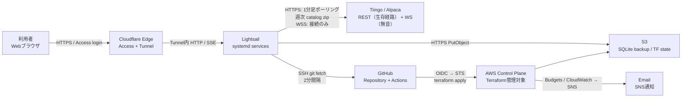

読み方:

1. ブラウザが直接 Lightsail の公開IPへ接続する経路はない。
2. Webトラフィックは Cloudflare Edge で Access 認証され、既存の外向きTunnelを通る。
3. 市場データ取得、コード取得、バックアップ送信もすべてホストからの外向き通信である。
4. GitHub Actions はアプリバイナリをホストへ送らず、AWSの構成だけをTerraformで更新する。
5. provider へ向かう通信のうち、REST だけが枠を消費する。週次の ticker catalog は
   API エンドポイントではなく静的な zip なので、回数に数えられない。

## 5. AWS／ネットワークアーキテクチャ

### 5.1 論理構成

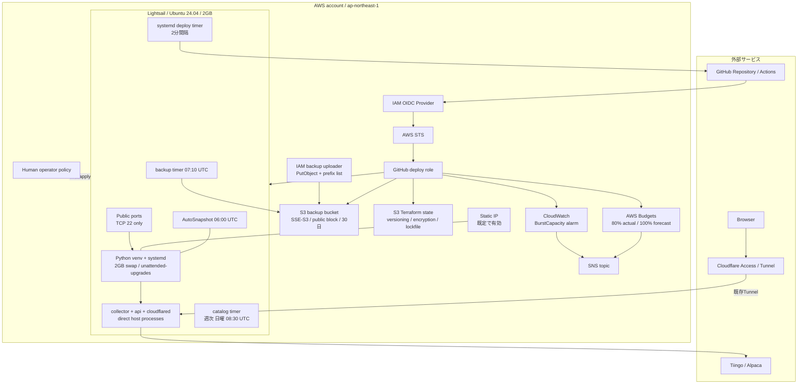

### 5.2 インバウンドとアウトバウンド

| 方向 | 通信 | 用途 | 制御 |
|---|---|---|---|
| inbound | TCP 22 | 管理SSH | `lightsail-connect` alias、または明示CIDRのみ |
| inbound | TCP 80/443 | なし | Terraform の public ports から除外 |
| outbound | Cloudflare Tunnel | Webの公開経路を維持 | `cloudflared` token |
| outbound | HTTPS | **1分足ポーリング**、gap補完、JWKS | provider key + RestBudget／公開JWKS |
| outbound | WSS | 市場データストリーム（無料枠では無音） | provider API key |
| outbound | HTTPS | 週次 ticker catalog zip（`apimedia.tiingo.com`） | 認証不要の静的ファイル。REST枠を消費しない |
| outbound | HTTPS | 銘柄検索のprovider fallback（catalogに無い語のみ） | provider key + RestBudget |
| outbound | SSH 22 | GitHub private repo の fetch | read-only deploy key |
| outbound | HTTPS | S3へのバックアップ | write-onlyに近いIAM key |
| outbound | HTTPS | OS package／Python依存／AWS CLI取得 | ホストの通常インターネット接続 |

Lightsail は dual-stack のため、Terraform は IPv4 と IPv6 のSSH許可元を別々に
明示する。空リストをそのまま Lightsail API へ渡すと全開放として扱われ得るため、
「許可なし」は `127.0.0.1/32` と `::1/128` の到達不能な番兵値へ変換する。

### 5.3 Webリクエストのセキュリティフロー

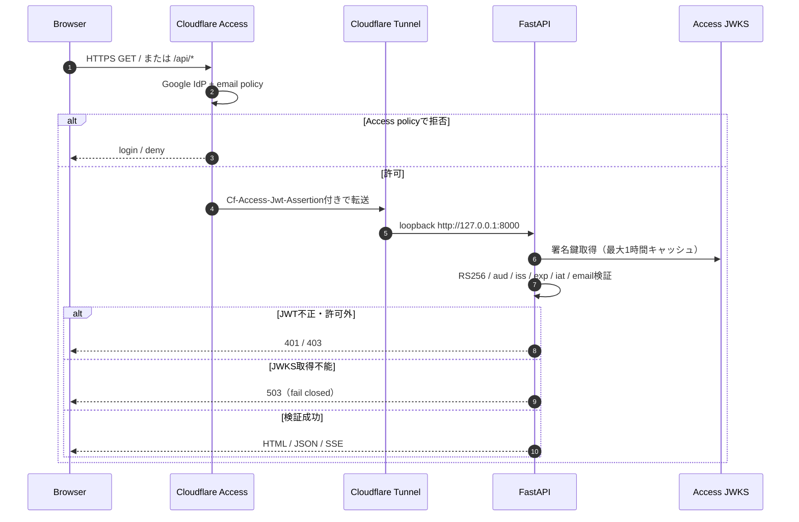

アプリは `/api/livez` 以外の静的ファイル、API、SSEを同じミドルウェアで保護する。
Cloudflare 側のポリシーを誤って緩めても、アプリのJWT検証とメールallow-listが
残る。レスポンスには CSP、`X-Frame-Options: DENY`、`nosniff`、
`Referrer-Policy: no-referrer` が付与される。

## 6. Lightsail 上のランタイム

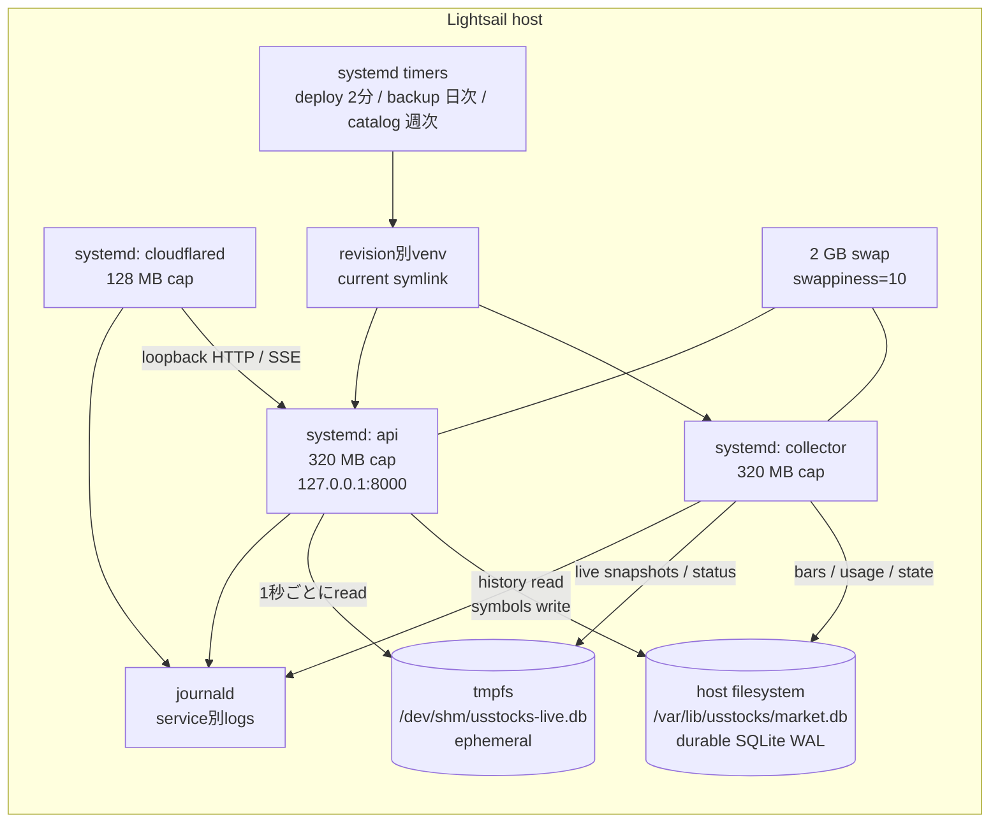

### 6.1 systemdサービス

| サービス | エントリポイント | 責務 | 制限／ヘルス |
|---|---|---|---|
| `usstocks-collector` | `current/venv/bin/python -m usstocks.collector` | RESTポーリング、集約、補完、時系列書込 | 320MB。15秒heartbeat |
| `usstocks-api` | `current/venv/bin/python -m usstocks.api` | REST、SSE、静的画面、銘柄更新 | 320MB。`/api/livez` |
| `usstocks-cloudflared` | `cloudflared tunnel ...` | 外向きTunnel | 128MB。host port公開なし |

collector と API は同一releaseのvenvから別プロセスとして起動する。release symlinkで
コード世代を揃えつつ、片方だけの再起動もできる。フロントエンドはrelease内の`web/`
から配信され、Node.jsやDocker buildを必要としない。Composeは互換経路として残るが、
同時起動しない。

常駐しないunit（timer駆動）:

| Timer | 周期 | 内容 |
|---|---|---|
| `usstocks-deploy.timer` | 2分 | `origin/main`をfetchし、変化があればrelease切替 |
| `usstocks-catalog.timer` | 週次 日曜 08:30 UTC | ticker catalog を再構築。`Persistent=true` で停止中の回を取り戻し、`RandomizedDelaySec=3600` で配信元への集中を避ける。米国市場が閉じている時間帯を選び、collector の書込ロックと競合させない |
| `usstocks-backup.timer` | 日次 07:10 UTC | 整合コピー → 検証 → gzip → S3 |
| `usstocks-corpus.timer` | Tue–Sat 12:30 JST | 調整済み日足を段階取得しParquet／S3へ確定 |
| `usstocks-news-corpus.timer` | 毎日13:00 JST | Notionを論理同期し、変更日partitionだけS3へ確定 |
| `usstocks-event-study.timer` | 毎日13:30 JST | ローカルcorpusをDuckDBで分析し、manifestを最後にS3へ確定 |

`deploy/systemd/*.service` や timer を変更した場合は、ホストの `/etc/systemd/system`
へ反映するため `deploy/systemd/install.sh` の再実行が必要である。

### 6.2 ストレージ

| ストア | 永続性 | 主な内容 | Writer | Reader |
|---|---|---|---|---|
| `market.db` | `/var/lib/usstocks` | bars、symbols、usage、collector state | collector、APIはsymbolsのみ | API、collector |
| `market.db-wal/-shm` | 同一directory | SQLite WAL | SQLite | SQLite |
| `live.db` | `/dev/shm` tmpfs | 現在値、現在足、collector status | collector | API |
| journald | host disk | service標準出力 | systemd | operator |
| Lightsail snapshot | AWS管理 | whole disk のcrash-consistent copy | Lightsail | recovery |
| S3 backup | off-instance | 検証済み `market-*.db.gz` | backup script | operator |

`live.db` を `market.db` から分離することで、ティックごとの短命な更新が永続DBの
1分足書込と競合せず、SSD書込も抑える。tmpfsを失っても次の約定で再構築される。

## 7. 収集フロー

`bars_1m` へ辿り着く経路は2つある。現在動いているのは REST 側だけだが、
両者は同じ主キーへ書くので、有料枠へ移ってストリームが復活しても行は重複しない。

**経路A: REST ポーリング（現在の生存経路）**

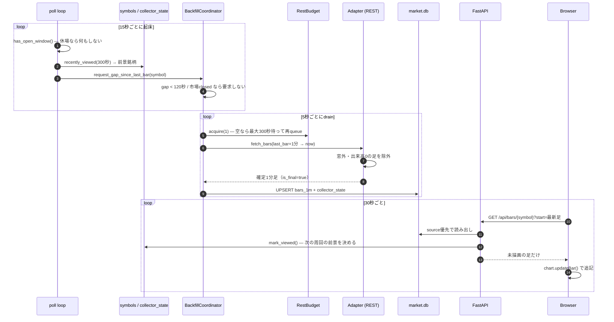

**経路B: WebSocket ストリーム（無料枠では無音）**

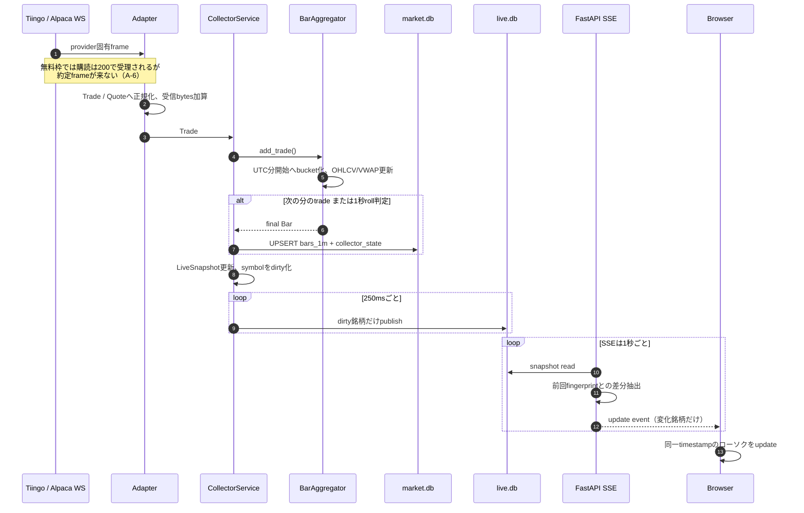

### 7.1 1分足の規則

| 項目 | 実装 |
|---|---|
| 時刻 | UTCの分開始時刻 |
| ストリーム入力 | `Trade` のみ。`Quote` は足に混ぜない |
| REST入力 | providerの確定1分足をそのまま `is_final=true` で保存 |
| OHLC | 最初、最大、最小、最後の約定価格 |
| Volume | 非負の約定size合計 |
| VWAP | `Σ(price × size) / Σ(size)` |
| 確定 | 次分の約定、または毎秒のroll判定 |
| 無約定分 | 人工的な足を作らない |
| **出来高0の足** | **取り込み時に破棄。** Tiingo は無約定の分にも直前終値の足（始=高=安=終、出来高0）を返し、`forceFill=false` でも抑止されない。そのまま保存すると「その価格で推移した」と描かれ、仕様書3.3の「無い動きを描かない」に反する（A-5） |
| 遅延約定 | 90秒以内で直前確定足がメモリにあれば再計算しupsert |
| 訂正／取消（Alpaca） | `c`／`x` フレームは warning へ記録して破棄。集計済み bar の再計算は行わない |
| shutdown | 作成中の足をfinalとしてflush |

DBの主キーは `(symbol, timestamp_utc, source)` である。upsertは
「新規がfinal、または既存がnon-final」のときだけ更新するため、再起動直後の
不完全な足で確定足を壊さない。異なるデータソースは別行として共存する。

### 7.2 ソース選択

同一銘柄・同一分に複数ソースの行がある場合、読み出し時に
`USSTOCKS_SOURCE_PRIORITY` の順で1本を選ぶ。既定は Tiingo、Alpaca の順。
各API応答は採用元を含み、期間中にソースが混在すれば画面へ表示する。切替は
`USSTOCKS_PRIMARY_SOURCE` を変えてcollectorを再起動する手動操作で、自動failover
は実装していない。

## 8. 再接続とREST欠損補完

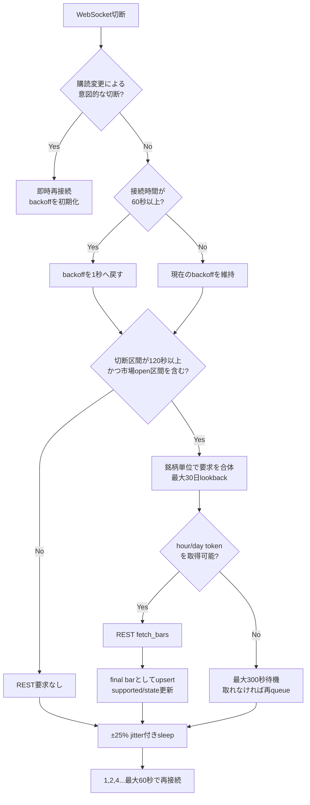

`BackfillCoordinator` の入口は4つある——起動時、購読銘柄の追加時、切断からの復帰時、
そして**定常のポーリング**である。入口が違うだけで、gap判定・要求合体・token取得は
共通なので、無料枠を守る制御が1か所に集まる。

**poll loop の判断順序:**

| # | 判定 | やらない条件 |
|---:|---|---|
| 1 | 15秒ごとに起床 | 購読銘柄が0本 |
| 2 | `has_open_window(now-2分, now)` | **市場が閉じていれば何もしない**——休場中に枠を消費しない |
| 3 | `recently_viewed(300秒)` から前景銘柄を1つ選ぶ | 5分以内に誰も見ていなければ前景なし |
| 4 | 前景は90秒経過で対象、他は3600秒経過で対象 | まだ間隔に達していない |
| 5 | `request_gap_since_last_bar()` | gapが120秒未満（= 前景の実効間隔が約2分になる理由） |
| 6 | backfill loop が5秒後に drain、token を1つ消費 | token が無ければ最大300秒待って再queue |

REST利用数は `api_usage` に時間枠・日枠で永続化される。collectorがクラッシュしても
枠がリセットされず、再起動ループで無料枠を使い切らない。WebSocket／RESTの受信
bytes差分も日・月単位で同じテーブルへ記録し、月間予算の80%で警告する
（ストリームが無音の現在、この値はほとんど増えない。「月間受信 0.0 MB」が
A-6 を最初に示していた兆候だった）。

provider が 429 を返した場合も**要求を捨てずに再queueし、300秒のcooldownを置く**。
捨てると、無関係な要因で同じ銘柄が再requeueされるまで gap が埋まらないままになり、
一時的な 429 が恒久的な欠損に変わる。

起動時、購読銘柄追加時、長い切断後、そしてポーリング周期ごとに
`last_bar_timestamp + 1分` から現在までを補完する。RESTから得たバーは
プロバイダーの確定値として `is_final=true` で保存される。

## 9. ブラウザ／API／SSEフロー

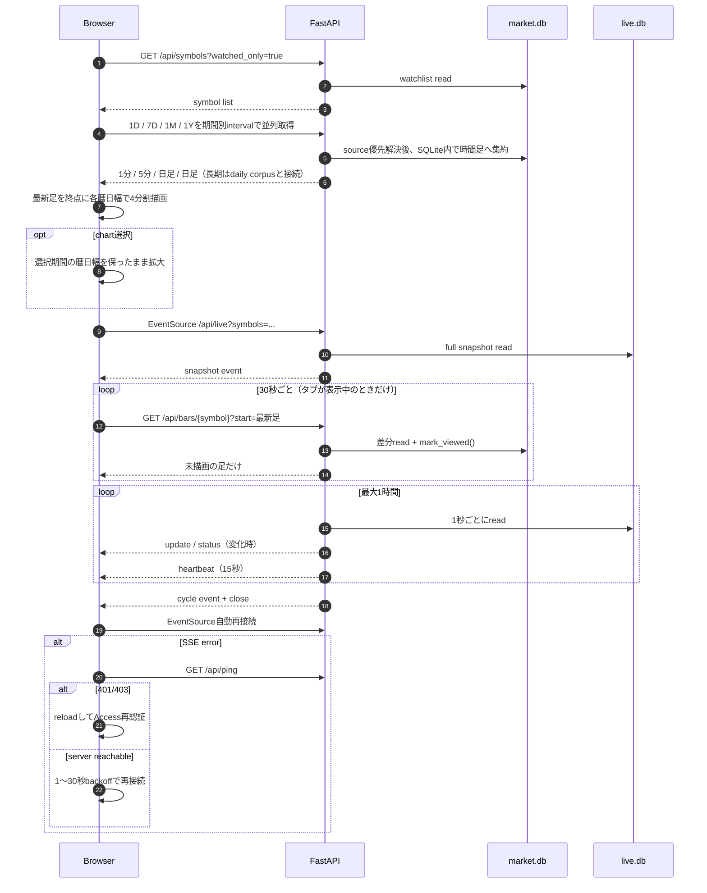

APIは1ワーカーで動作する。SQLiteコネクションはスレッドローカルで、WALにより
複数readerと短時間のwriterを共存させる。APIも `symbols` だけは書き込むため、
「単一writer」は時系列テーブルに限定される。collectorは5秒ごとにwatchlistを読み、
変更があればWebSocketを張り直す。

**30秒の差分取得について。** この要求は SQLite の読み出しであって provider へは
届かないため、頻度は無料枠ではなく「確定した1分足をどれだけ早く見せたいか」だけで
決まる。同時に、これが `viewer_idle_seconds=300` を満たし続ける唯一の仕組みでもある。
打刻が止まれば5分後に前景から外れ、1時間間隔の sweep へ落ちる。タブが非表示の間は
停止し、復帰時に即座に1回実行する——誰も読んでいないチャートに枠を使わないためである。

**フロントエンドのモジュール:**

| File | 役割 |
|---|---|
| `web/app.js` | watchlist、検索、1D／7D／1M／1Yの4分割、拡大切替、30秒の差分取得（`refreshTail`）、SSE、再接続判定。期間を変えず、1分／5分／日足／日足へ集約する。1M／1Yは長期daily corpusをmarket.dbの直近日足で更新する |
| `web/chart.js` | Lightweight Charts。軸フォーマット、legend、出来高、MA描画。非取引日でも期間幅が縮まらないよう不可視anchorで時間軸を固定。拡大／4分割復帰時も同じ期間幅を再適用 |
| `web/timezone.js` | 表示タイムゾーンの単一の情報源。既定 `America/New_York`、localStorage保存 |
| `web/viewstate.js` | `{days, extended, barSpacing, rightOffset, movingAverages}` を保存 |
| `web/indicators.js` | 移動平均。窓が満たない間は点を出さない |

主要エンドポイント:

| 種別 | パス | データ経路 |
|---|---|---|
| 履歴 | `GET /api/bars/{symbol}` | `market.db` → JSON。**副作用として `last_viewed_at` を打刻** |
| ライブ | `GET /api/live` | `live.db` → SSE |
| snapshot | `GET /api/live/snapshot` | `live.db` → JSON |
| 銘柄 | `GET/PUT/DELETE /api/symbols` | `market.db.symbols` |
| 検索 | `GET /api/symbols/search` | watchlist → `symbol_catalog` → provider の3段。provider段のみREST枠を消費し、10分のLRUで再問い合わせを抑える |
| export | `GET /api/export/csv` | `market.db` → streaming CSV |
| export | `GET /api/export/parquet` | optional pyarrow、メモリ上で生成 |
| health | `GET /api/health` | DB、disk、live status、budget |
| auth probe | `GET /api/ping` | 認証session確認 |
| liveness | `GET /api/livez` | 唯一の無認証パス |

## 10. データベース構成と書込所有権

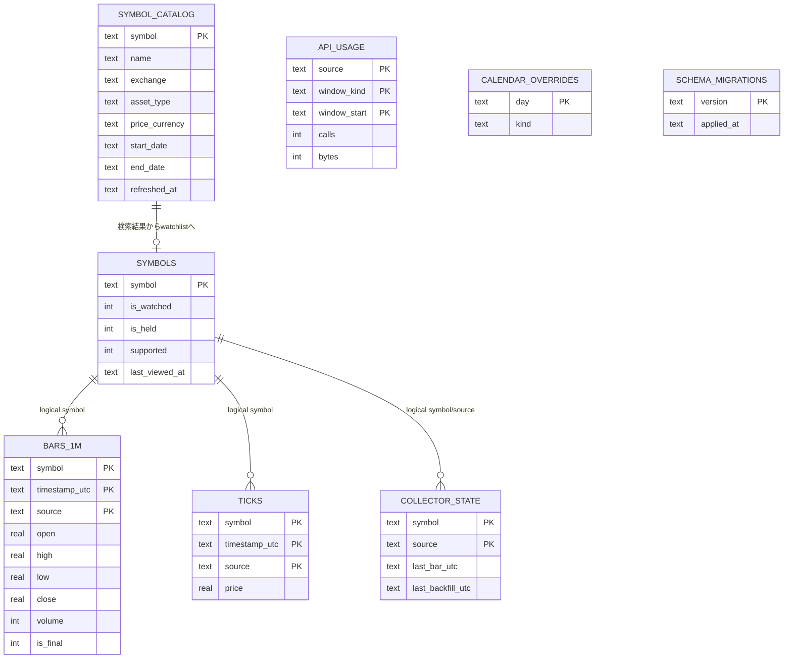

SQLiteには外部キーを置かず、論理的な関係として扱う。`ticks` は
`USSTOCKS_TICK_RETENTION_DAYS=0` が既定なので通常は空である。

| テーブル | collector | API | catalog timer | 用途 |
|---|---:|---:|---:|---|
| `bars_1m` | write | read | — | 1分足 |
| `symbols` | read／support更新／`last_viewed_at` read | read／write／`last_viewed_at` write | — | watchlist と「いま見られている銘柄」 |
| `symbol_catalog` | — | read | write/prune | ローカル検索用のticker台帳 |
| `ticks` | optional write/prune | readなし | — | 秒レベル約定保存 |
| `api_usage` | write/read | health read | — | REST／帯域budget |
| `collector_state` | write/read | 原則readなし | — | gap検出 |
| `market_calendar_overrides` | 起動時read | 直接APIなし | — | 臨時休場 |
| `schema_migrations` | startup | startup | — | forward-only migration |

`symbols.last_viewed_at` は API が書き、collector が読む。両プロセス間に新しい IPC を
足さずに済ませるため、既に数秒ごとに読まれているこのテーブルへ相乗りしている
（A-3 と同じ判断）。

`symbol_catalog` は使い捨てである。ダウンロードから再構築できるので、失っても
検索が劣化するだけで、利用者が入力したものは何も失われない。約10万行を扱うが、
1トランザクションで書くと collector の bar 書込が busy timeout（5秒）を使い切るため、
2,000行ずつのチャンクに分けて書く。整合性は行ごとの `refreshed_at` スタンプで担保し、
取り込み完了後に「今回のスタンプ以外」を削除する。スタンプにはマイクロ秒と UUID を
含める——秒精度では、同じ秒に2回走ったとき古い行が消えずに残った。

## 11. CI/CD とインフラ反映

### 11.1 コード上の実効フロー

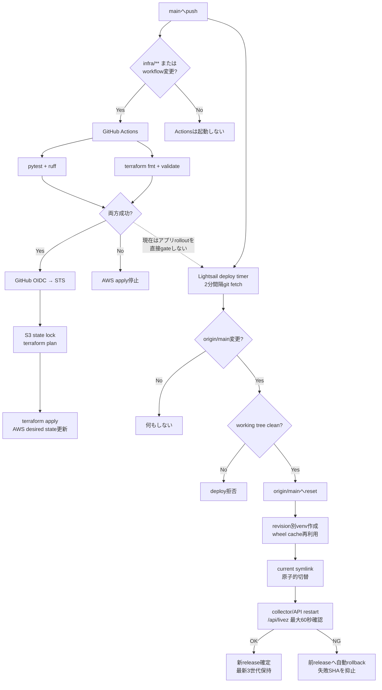

重要: infra／workflow変更を含むpushではGitHub Actionsとホストpullが並行して進む。
アプリだけのpushではActionsを起動せずhost pullだけが進む。いずれもdeploy agentは
workflow成功を確認しないため、テスト未実行または失敗したcommitでも`origin/main`に
存在すればアプリへ反映し得る。

### 11.2 GitHub Actions

| イベント | test/lint | Terraform validate | Terraform apply |
|---|---:|---:|---:|
| Pull Request | Yes | Yes | No |
| `main` push（infra／workflow変更） | Yes | Yes | 成功後にYes |
| `main` push（アプリのみ） | No | No | No。host pullだけ |
| manual dispatch `apply=false` | Yes | Yes | No |
| manual dispatch `apply=true` | Yes | Yes | 成功後にYes |

applyはOIDCで短期資格情報を取得する。信頼policyは
`repo:<owner>/<repo>:ref:refs/heads/main` に固定され、PRやforkからは引き受けられない。
Terraform state は事前作成した別S3バケットの `usstocks/terraform.tfstate` に保存し、
S3 native lockfile とworkflow concurrencyで競合を抑える。

### 11.3 Pullデプロイ

deploy agent は次の安全策を持つ。

- `flock` で同時実行を防ぐ
- branchが変化していない場合は再起動しない
- local変更があればdeployを拒否
- private repositoryはread-only deploy keyで取得
- 完成前のreleaseは`.build-*`へ隔離
- `current` symlinkを原子的に切り替える
- collector/APIのactive状態と`/api/livez`を最大30回、2秒間隔で確認
- health失敗時は前releaseへ自動rollback
- 失敗SHAは次のrevisionまで再試行せず、2分ごとの切断ループを防ぐ
- revisionを3世代保持し、pip wheel cacheをrelease間で共有

このpull経路はGitHub Actionsを利用しない。Actionsのquotaを使い切っていても
`main`を取得できる一方、CI成功をrollout条件にはしていない。

## 12. バックアップ／リストア

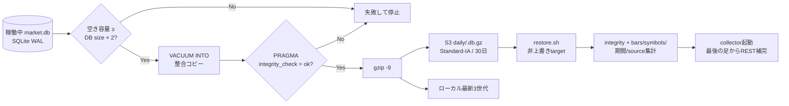

### 12.1 保護レイヤー

| レイヤー | 整合性 | 主用途 |
|---|---|---|
| SQLite WAL | process crash耐性 | 通常運転 |
| Lightsail AutoSnapshot | crash-consistent whole disk | host／disk復旧 |
| `VACUUM INTO` + integrity check | application-consistent DB | 確実な履歴復旧 |
| provider REST backfill | 市場データ再取得 | backup後の欠損縮小 |

日次timerは07:10 UTC（米国時間のafter-hours後）を意図し、S3は30日保持する。
backup uploaderは `daily/*` への `PutObject` と同prefixのlistだけを持ち、読み戻しや
削除を許可しない。アクセスキー自体はTerraformで作らず、stateへ秘密を残さない。

## 13. 監視と運用シグナル

### 13.1 アプリ内health

`/api/health` は次を集約する。

- API process uptime
- collector statusの更新時刻、接続状態、最終message／trade
- DB size、bar件数、disk使用率
- 月間受信bytesと警告比率
- RESTの時間／日利用数
- backup作成に必要な空き容量

判定:

| 問題 | 条件 | overall |
|---|---|---|
| `collector_status_stale` | statusがない、または60秒超 | `down` / HTTP 503 |
| `collector_disconnected` | statusは新しいが非接続 | `degraded` |
| `bandwidth_budget_high` | 月間budgetの80%以上 | `degraded` |
| `disk_usage_high` | disk 70%以上 | `degraded` |
| `insufficient_headroom_for_backup` | free < DB size × 2 | `degraded` |

**この判定の盲点。** `collector_disconnected` は WebSocket が繋がっているかだけを見る。
無料枠では**繋がるがデータが来ない**ので、この項目は緑のまま実態を反映しない
（A-6 がログから分からなかったのと同じ構造の問題である）。実際の鮮度は
`/api/bars` の最新 timestamp、消費量は `rest_calls_hour` で見る。

### 13.2 基盤監視

- collectorの15秒heartbeatとAPI `/api/livez`
- systemd `Restart=always`: process異常終了から復帰
- systemd deploy timer: pull deploy失敗をjournalへ記録
- CloudWatch: Lightsail `BurstCapacityPercentage < 20%` が15分続けばSNS
- AWS Budgets: actual 80%、forecast 100%でSNS
- journald: unit単位でcollector/API/cloudflaredのlogを保持

現状、collectorの切断、backup失敗、service unhealthyをSNSへ直接送る仕組みは
Terraformにはない。外形監視も `/api/health` が認証必須のため別途必要である。

## 14. 障害時の挙動

| 障害 | 自動挙動 | データ影響／手動対応 |
|---|---|---|
| provider WS切断 | 1〜60秒指数backoff + jitter | 120秒以上のopen区間をREST補完 |
| **WSは繋がるがデータが来ない** | WS単独では`connected`のまま。生存経路のRESTは3回連続空でsymbolを警告 | 最新bar、symbol note、月間受信bytesで判断 |
| provider REST枠枯渇 | window更新まで待機、timeout後requeue | 補完完了が遅れる。検索はローカル結果へ縮退する |
| provider が 429 | 要求を再queueし300秒cooldown | gapは次の周回で埋まる |
| catalog import失敗 | 前回の行が残り検索は動き続ける | journalを確認。新規上場が引けないだけ |
| ブラウザのタブを閉じた | 5分後に前景から外れ1時間sweepへ | 次に開いた1回で全て埋まる |
| Tiingo長時間障害 | 自動切替なし | operatorがAlpacaへ明示切替 |
| collector crash | systemdが再起動 | 作成中barは未flushの可能性、REST補完 |
| API crash | 独立再起動 | 収集は継続、SSE client再接続 |
| `live.db`消失 | 次のtradeで再構築 | durable historyは無影響 |
| `market.db`破損／host喪失 | snapshotまたはS3からrestore | 起動後にREST補完 |
| Cloudflare Access session失効 | SSE error後 `/api/ping` が401、画面reload | Google再認証 |
| JWKS取得不能 | APIが503 | fail closed。復旧待ち |
| disk逼迫 | health degraded、backupは事前拒否 | 容量確保またはinstance移行 |
| CPU burst枯渇 | CloudWatch → SNS | collector遅延。bundle見直し |
| 新revisionのAPI不健康 | 前releaseへ自動rollback | 失敗SHAを調査し、次revisionで修正 |

## 15. 構成値と秘密情報

### 15.1 主要な既定値

| 設定 | 既定値 |
|---|---:|
| 最大購読銘柄 | 10 |
| REST | 50 calls/hour、1,000 calls/day |
| 前景ポーリング間隔 | 90秒（min_gapに律速され実効は約2分） |
| 背景sweep間隔 | 3,600秒 |
| REST poll終了 | 通常16:45 ET／短縮取引日は通常終了45分後 |
| 成功空fetch警告 | 3回連続（有効bar取得で自動解除） |
| 「見られている」判定の猶予 | 300秒 |
| ブラウザの差分取得 | 30秒（ローカルDB読み出し。枠を消費しない） |
| catalog refresh | 週次 日曜 08:30 UTC ±60分 |
| catalog の保持条件 | `end_date` が30日以内、Stock/ETF、USD建て |
| 月間受信budget | 1,000,000,000 bytes |
| 帯域警告 | 80% |
| 短いgapの補完抑止 | 120秒 |
| 遅延約定の猶予 | 90秒 |
| live.db publish | 250ms |
| collector status heartbeat | 15秒 |
| SSE poll | 1秒 |
| SSE heartbeat | 15秒 |
| SSE最大寿命 | 1時間 |
| API graceful shutdown | 10秒（systemd stop上限15秒） |
| 最大history response | 20,000 bars |
| symbol table poll | 5秒 |
| systemd memory cap | collector 320MB / API 320MB / tunnel 128MB |
| live tmpfs | `/dev/shm/usstocks-live.db` |
| host swap | 2GB |
| deploy poll | 2分 |
| backup retention | 30日 |
| monthly AWS budget | 12 USD |

### 15.2 秘密情報の置き場所

本番値は `/etc/usstocks/usstocks.env` に置く。systemdは`EnvironmentFile`として
直接読むためrepo内へのsecret symlinkは不要である。Terraform `user_data` には秘密を
入れず、初回起動時は空のplaceholderだけを作る。GitHub ActionsにはAWS長期キーを
置かずOIDCを使う。

秘密に該当するもの:

- Tiingo API key
- Alpaca API key／secret
- Cloudflare Tunnel token
- Cloudflare Access AUD
- S3 backup uploader access key／secret
- GitHub deploy private key
- Notion token／DB ID（host envへ複製せず、SSMの`/teiten`からoneshotだけが読む）

`USSTOCKS_ALLOWED_EMAILS` と `USSTOCKS_SOURCE_PRIORITY` は list 型だが、
環境変数からは `a@example.com,b@example.com` のカンマ区切りで渡す。pydantic-settings は
list 型フィールドを環境変数ソースの内部で JSON デコードしてしまうため、両フィールドには
`NoDecode` を付けてある。これが無いと、値の中身も受理される形式も示さないまま
数フレーム下で `JSONDecodeError` になる。

## 16. 現行実装で確認できた運用上の注意点

### 16.1 「沈黙」はWSとRESTを分けて扱う

collector は自分が処理する `messageType`（`A`=データ、`E`=エラー）だけを記録する。
購読確認 `I` とハートビート `H` は痕跡なく捨てられるため、**「接続はしているが
データが来ない」をログから判定できなかった**。想定したメッセージを前提に設計した
WS計装だけでは、沈黙という失敗を報告できない。診断には生フレームを印字するプローブ
（`scripts/probe_tiingo_ws.py`、`scripts/probe_alpaca_ws.py`）を書き足す必要があった。
一方、現在の生存経路であるRESTは、成功しても0本だったfetchを銘柄ごとに数え、
3回連続で`symbols.supported=0`とnoteを設定する。次に有効barを得た時点で自動解除する。
ポーリング自体も通常16:45 ETで止めるため、providerの既知の配信終了後を誤警告しない。

同じ理由で、`/api/health` の `connected` は現在の実態を表さない（13.1 参照）。

### 16.2 REST枠には履歴取得用の余白を設けた

前景と保険sweepは通常約39 calls/hour（上限50）。残りを日足コーパス、起動時backfill、
検索へ回せる。ただし前景を実効90秒へ縮めると通常分だけで49 calls/hourになる。
`/api/health` の `rest_calls_hour` は、この構成では見ておく価値のある値である。

### 16.3 アプリrolloutはCI成功でgateされていない

GitHub ActionsのTerraform applyにはtest/lintのgateがあるが、Lightsailのdeploy agentは
`origin/main` の更新だけを見ている。ワークフロー結果との連携、release tag、成功commit marker
はない。アプリのCDをテスト成功後に限定するには、deploy対象を成功済みSHA／tagへ変えるか、
GitHub APIでcheck suite成功を確認する仕組みが必要である。

Actions quota超過中もpull deployは動くが、その間はローカルでtest/lintを通してから
`main`へ反映する必要性がさらに高い。

### 16.4 初回pull agent有効化は手動ブートストラップを要する

Terraform `user_data` はOS、Python、ユーザー、ディレクトリ、env placeholder、
repo URLまでを作るが、private repositoryをcredential付きでcloneしない。最初のcloneと
`deploy/systemd/install.sh`実行はout-of-bandで必要である。これは秘密のdeploy keyを
metadataから読めるuser_dataへ埋め込まないための境界である。

### 16.5 Composeへ戻す場合はDBの再移行が必要

systemd release間のrollbackは自動化されている。一方、Composeとsystemdはdurable DBの
配置が異なるため、runtime自体をComposeへ戻す場合はcollectorを両方停止し、
`/var/lib/usstocks/market.db`をnamed volumeへSQLite online backupで戻す必要がある。
古いCompose volumeをそのまま起動すると、切替後に収集した履歴が欠落する。

### 16.6 監視通知の対象は限定的

TerraformでSNSへ接続されるのはLightsail CPU burstとAWS Budgetsである。backup失敗、
collector stale／disconnect、systemd restart、disk容量はアプリ上で検出またはログ化
されるが、SNS通知へは配線されていない。

### 16.7 system unit変更はinstallerの再実行が必要

通常のPython／web変更はpull agentだけで反映される。`deploy/systemd/*.service`、
installer、deploy service unitを変更した場合は、ホストの`/etc/systemd/system`へ
反映するため`deploy/systemd/install.sh`を再実行する。catalog timer を追加したときが
これに当たった——コードは配られていたが、timer はホストに存在しなかった。

## 17. ディレクトリ／コンポーネント対応

```text
.
├── src/usstocks/
│   ├── adapters/          # provider境界、WS/REST正規化（tiingo / alpaca / mock）
│   ├── collector/         # 集約、再接続、補完、ポーリング、quota、publish
│   ├── corpus/            # 調整済み日足 + Notion news、Parquet、S3差分upload
│   ├── api/               # FastAPI、認証、REST、SSE、静的配信
│   ├── db/                # SQLite接続、repository、live store、migration ×3
│   ├── calendar_us.py     # 米国市場日／session判定
│   ├── catalog.py         # 週次 ticker catalog import（REST枠を使わない検索の土台）
│   ├── config.py          # environment設定とfail-fast検証
│   └── models.py          # provider非依存domain model
├── web/                   # build不要の静的フロントエンド
│   ├── app.js             # watchlist / 差分取得 / SSE / 再接続
│   ├── chart.js           # Lightweight Charts（軸・legend・出来高・MA・zoom復元）
│   ├── timezone.js        # 表示タイムゾーンの単一の情報源
│   ├── viewstate.js       # 期間・zoom・MAの永続化
│   ├── indicators.js      # 移動平均
│   └── vendor/            # vendored chart library
├── data/
│   └── universe.csv       # AI・半導体50銘柄とsubsector
├── deploy/
│   ├── Dockerfile
│   ├── docker-compose.yml
│   ├── agent/             # pull CD用script + systemd timer
│   ├── backup/            # consistent backup / verified restore
│   ├── cloudflared/       # 手動Cloudflare設定のreference
│   └── systemd/           # direct runtime、deploy／backup／catalog／corpus timer
├── infra/
│   ├── terraform/         # AWS desired state
│   └── iam/               # 初回applyを行うhuman operator policy
├── .github/workflows/     # test / validate / terraform apply
├── scripts/               # local dev、seed、state bootstrap、SSH CIDR更新、
│                          # provider WSプローブ（A-6の一次証拠）
└── tests/                 # adapter、collector、API、DB、calendar等
```

## 18. トレーサビリティ

| 説明対象 | 主な一次情報 |
|---|---|
| **なぜ50回/時で足りるのか** | `collector/service.py` の `_poll_loop()`、`db/migrations/0003_symbol_viewing.sql`、`web/app.js` の `refreshTail()` |
| 予算の宛先決定 | `repository.mark_viewed / recently_viewed`, `api/routes/bars.py` |
| ローカル検索 | `catalog.py`, `db/migrations/0002_symbol_catalog.sql`, `api/routes/symbols.py` |
| A-6の一次証拠 | `scripts/probe_tiingo_ws.py`, `scripts/probe_alpaca_ws.py`, `docs/spec-review.md` A-6 |
| direct runtime／release／health | `deploy/systemd/`, `deploy/agent/deploy-agent.sh` |
| Compose互換経路 | `deploy/docker-compose.yml`, `deploy/Dockerfile` |
| Lightsail／firewall／snapshot | `infra/terraform/lightsail.tf` |
| S3／backup IAM | `infra/terraform/backup.tf` |
| 日足コーパス／共有REST予算 | `corpus/daily.py`, `collector/ratelimit.py`, `data/universe.csv`, `deploy/systemd/usstocks-corpus.*` |
| Notionニュースコーパス | `corpus/news.py`, `deploy/systemd/usstocks-news-corpus.*`, teitenのNotion DB／SSM |
| イベントスタディ／日次レポート | `corpus/event_study.py`, `corpus/sql/event_study.sql`, `api/routes/analysis.py`, `web/reports.*`, `deploy/systemd/usstocks-event-study.*` |
| budget／SNS／CloudWatch | `infra/terraform/monitoring.tf` |
| GitHub OIDC権限 | `infra/terraform/github_oidc.tf` |
| CI apply | `.github/workflows/deploy.yml` |
| pull CD | `deploy/agent/deploy-agent.sh` と systemd unit |
| host bootstrap | `infra/terraform/templates/bootstrap.sh.tftpl` |
| backup／restore | `deploy/backup/backup.sh`, `restore.sh` |
| auth boundary | `src/usstocks/api/app.py`, `auth.py` |
| realtime flow | `src/usstocks/collector/service.py`, `aggregator.py` |
| backfill／quota | `backfill.py`, `ratelimit.py` |
| DB schema／ownership | `db/migrations/`, `repository.py`, `live_store.py` |
| SSE／browser reconnect | `api/routes/live.py`, `web/app.js` |

## 19. 定量分析用の日足＋ニュースコーパス

リアルタイムチャートの10銘柄とは別に、AI・半導体50銘柄のイベントスタディ用データを
構築する。分足履歴は翌日に再取得できない実例があるため、コーパスはTiingo dailyの
調整済み日足を正本とする。Phase 0のAAPL実測では1990年以降9,211行が1コールで返り、
`adjClose`、`splitFactor`、`divCash`も存在した。

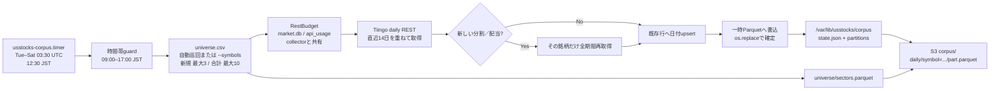

### 19.1 なぜ別のREST予算を持たないのか

Tiingoの上限はAPIキー単位である。collectorとコーパスが別々に「50 calls/hour」を
管理すると、両方が最後の1トークンを使い、provider側では上限超過になる。
`RestBudget.try_acquire()` は `BEGIN IMMEDIATE` 内でhour/dayを確認して同時に加算する。
collectorとoneshot timerが別プロセスでも、同じ `market.db.api_usage` が直列化点になる。

### 19.2 ユニークシンボル上限への安全策

月間ユニークシンボル数はAPIから取得できない。無人実行は新規3銘柄、合計10銘柄を
上限とし、HTTPエラーが出た時点で残りを止める。既存銘柄は
`last_success_utc` が古い順にローテーションするため、CSV先頭だけが更新され続ける
飢餓も起こさない。上限を確認できるまでは、50銘柄を一度に投入しない。

### 19.3 書込・再送・権限境界

1銘柄分のParquetは同一ディレクトリの一時ファイルへ書き、完成後だけ置換する。
ローカル確定後にS3 uploadが失敗した場合、`state.json` の `pending_upload` を残し、
次回はAPIを再消費せずS3送信だけを再試行する。Lightsail上の既存backup uploaderは
`daily/*` と `corpus/*` だけへ `PutObject` でき、削除やS3読取りは許可しない。
加えてPhase 2に必要なSSMの`/teiten/notion-token`と`/teiten/notion-db-id`だけを
`GetParameter`できる。LLM API keyを含む他のSSM parameterは読めない。
S3送信はrevision venvのboto3から行い、SSE-S3（AES256）を明示する。

### 19.4 ランタイムへの影響

`pyarrow` はrevision venvへ入るが、collector/APIはimportしないため常駐メモリは増えない。
コーパス処理はoneshotで `MemoryMax=512M`、`TimeoutStartSec=1800`。2GB Lightsail上で
collector/APIと併存できる上限を設け、米国市場が閉じた時間だけ動かす。systemd unitを
追加する変更なので、初回だけunitの配置とtimerのenableが必要である。

2026-07-31の本番実測では、物理メモリ1.9GiBのうち使用584MiB、available 1.3GiB、
swap使用52KiB、root disk使用5.6GiB / 58GiB（10%）だった。`systemctl show` の
`MemoryCurrent` はcollector約29.7MiB、API約43.8MiBで、常駐2プロセス合計は約73.5MiB。
日足処理を市場休場中のoneshotかつ512MiB上限にする限り、現在の2GBプランには十分な余白がある。

2026-07-31に本番導入済み。timerはenabled/activeで、初回はNVDA 6,922行、
AMD 9,211行、INTC 9,211行を2026-07-30まで取得し、3 partitionすべてをS3へ送信した。
処理時間は約6秒、systemd計測のCPU時間は約1.3秒だった。

### 19.5 Notionニュースの差分同期

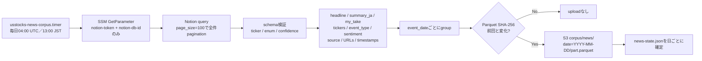

teitenがNotionの唯一のwriterであり、本アプリはread-only mirrorである。数百ページ規模では
全件queryは数リクエストなので、後編集やアーカイブも反映できる全論理同期を選ぶ。
Parquetの内容ハッシュが同じ日付はPUTしない。全ページがアーカイブされた日だけは、
同じschemaの0行Parquetを上書きし、`DeleteObject`権限なしで古いイベントを無効化する。

`XPost`の固定区切りから事実要約`summary_ja`とAI下書き`my_take`を分離する。
未知のenumや範囲外confidenceは黙ってnullへ落とさず同期全体を失敗させるため、
teiten側のschema変更を分析結果へ混入する前に検知できる。oneshotは`MemoryMax=384M`、
毎日13:00 JST実行で、常駐メモリとTiingo REST枠を消費しない。

### 19.6 Notionイベントと株価変動の突合（Phase 3実装）

Phase 3では、ニュースの各`ticker`を日足の`symbol`へ展開し、発表後
0/1/2/5/20取引日の調整済みリターンを計算する。入力とS3配置は本番稼働中で、
DuckDB SQL、テストfixture、Parquet／Markdown／HTMLレポート生成、systemd unitも
本番稼働中。

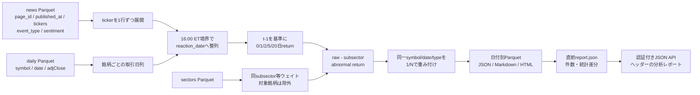

発表時刻をNew York時間へ直し、取引日の16:00より前は当日、以後・週末・休場日は
次の取引日を`reaction_date`とする。時刻が無いイベントは`timing_quality=date_only`
として残すが、時刻精度が必要な検定から分ける。カレンダー日を単純加算せず、
銘柄ごとの日足に存在する日付順で`t+h`を決める。

`raw_return_h = adjClose[t+h] / adjClose[t-1] - 1`とし、同じsubsectorの他銘柄
（最低3銘柄）の等ウェイトリターンを引いて`abnormal_return_h`を得る。
SPY／QQQ／SMHは未知の月間ユニークシンボル枠を消費するため初版の必須条件にしない。
必要な終値が無いhorizonは補間せず`NULL`にする。

日またぎの類似記事はNotionの正本を破壊的に統合しない。同一
`symbol + reaction_date + event_type`のページ数を`event_group_size`とし、
既定集計ウェイトを`1 / event_group_size`にする。20取引日窓が別イベントと重なる
場合は`overlap_count`を付け、全件の記述統計と重複窓を除いた検定を併記する。
集計軸はevent type、sentiment、subsector、confidence帯、importance、発表時間帯。
平均だけでなく中央値、勝率、四分位、95%信頼区間を出す。

日中発表前後を日足だけで分離することはできないため、この段階で測れるのは
「イベントと同日以降の変動の関連」であり、厳密な因果効果ではない。日次集計の
履歴閲覧UIは実装済みだが、1分足チャートへのニュースmarkerは別API/UIとして追加し、
必要ならPhase 4で対象イベントだけ分足をオンデマンド取得する。

実装は`corpus/event_study.py`が入出力・時刻正規化・atomic write・S3差分転送を担当し、
`corpus/sql/event_study.sql`が取引日整列、subject/peer return、重複weight、
集計統計を担当する。DuckDBは1 thread・256MBへ制限し、systemdは512MBで囲う。
毎日13:30 JSTのoneshotでPhase 1/2のローカルParquetだけを読むため、
ライブcollectorとREST予算を奪い合わない。S3では`manifest.json`を最後に更新し、
途中までuploadされた世代を完成済みと誤認しない。

成果物はJSTの日付ごとに`analysis/daily/date=YYYY-MM-DD/`へ保存し、同時に
`analysis/latest/`を更新する。各日次`report.json`には全summaryと直前版との差分を
含め、`analysis/index.json`が閲覧可能な日付を列挙する。認証済みAPIはJSONだけを読み、
DuckDB／pyarrowやイベント明細Parquetを常駐プロセスへimportしない。サイトヘッダーの
「分析レポート」から日付を選び、カバレッジ、今回の読み取り、前回比較、全体／種別別の
統計を参照できる。接続済みNotion記事が多い銘柄を既定選択する「銘柄フォーカス」では、
同一銘柄内の記事数、実効件数、反応日数、イベント種別、各horizonの加重平均・中央値・
上昇率・peer差平均を表示し、URL queryから別銘柄も選べる。
連続するhorizonは加重平均・反応日中央値・peer差の期間曲線、反応日は1日returnの
時系列barで先に見せる。全数値表は検算用に残し、記事別の長い明細は折りたたむ。
記事数はNotionの明示tickerだけで決めない。ニュース正本を変更せず、企業名が明記された
メモリ記事をMU／WDC／STXへ分析時補完し、各eventへ`explicit`または`inferred_alias`と
一致語を残す。画面でも根拠別件数を表示し、補完ルールの誤検出を監査できる。

イベント数が少ない導入期は集計値を無理に一般化せず、イベントごとのケース分析を出す。
反応前だけの同銘柄日足からreturn percentileと同規模変動後のベースレートを計算し、
直前5／20日モメンタム、60日出来高中央値比、利用可能な同subsector平均との差を併記する。
peerが3社未満の相対returnは参考値として残すが、正式なabnormal returnには昇格させない。
所見文はLLMではなく算出値をルールで文章化するため追加費用はない。Webと日次MD／HTMLには、
全horizonのraw return・percentile・観測数・peer比較と、類似変動後1〜20取引日の
上昇率・平均・中央値・中央50%範囲を連続系列で表示する。平均期待リターン最大の期間と、
forward windowの重複を実効標本数で補正した80%片側下限最大の保守候補を併記する。
分析対象を先行投入する場合は日足jobへ`--symbols`を渡す。指定先は50銘柄universe内に限定し、
共有REST予算、1実行の上限、安全時間帯を維持するため、ライブ取得のquotaを迂回しない。

2026-07-31の本番初回実行では、Notion 368ページからticker付き17イベントを展開し、
現時点の日足corpusへ1件を接続、16件を未接続として明示した。初回は6ファイルをS3へ
uploadし、同一入力での再実行は0 upload。CPU時間は約1.3秒だった。
timerはenabled/activeで、次回以降は日足partitionの段階追加に応じてmatched数が
自動的に増える。

### 19.7 ニュース全文資産の分離方針

Notionの要約だけでも価格反応日は計算できるが、将来の再分類や「なぜ動いたか」の検証には
取得時の情報量が足りない。現行teitenはRSS本文を最大2,000字までLLMへ渡すものの、
Notionへは500字要約と見立てだけを書き、LLM入力本文を保存していない。

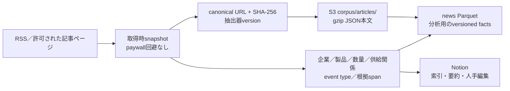

Notionは人が読む索引、S3は再処理可能な本文資産、Parquetは分析用の構造化事実とする。
sentimentは多数ある属性の1つに留め、企業・ticker、製品、工程、顧客／供給者、数量と単位、
価格・設備投資・生産能力、対象期間、発言主体、直接／間接影響、importance、confidence、
根拠spanをversion付きで残す。許諾できない媒体はURL、RSS本文、要約、hash、取得失敗理由だけを
保存し、認証・paywall・robotsを回避しない。

Notionの現行仕様ではAPIは平均3 request/秒、1 requestは500KB／1,000 blocks、rich textは
1 object 2,000文字。Freeの1人workspaceと有料planはblocks無制限だが、Freeでownerが2人以上
なら通算1,000 blocksで、削除しても枠は戻らない。容量だけなら本文textは置ける場合が多いが、
API分割、再抽出、重複排除、将来の移行を考えると全文正本をNotionにしない。

## 20. まとめ

このリポジトリは、小規模な個人用途に合わせて、外向き接続中心、二重認証、
単一ホスト、SQLite、pull型CDという一貫した設計を採っている。データ取得から画面までの
経路は短く、provider障害・API再起動・live state消失には局所的に回復できる。

当初の土台であった「WebSocketで常時受信」が無料枠では成立しないと分かった後も、
構成そのものは作り直さずに済んだ。REST が範囲を返すこと、`last_viewed_at` で予算の
宛先を選べること、ブラウザがローカルDBしか読まないこと——この3つが、
1時間50回という制約の下で数分おきの更新を成立させている。代償として、
秒単位のローソクは断念し、出来高の絶対値は他の板と比較できないものになった。

残る主要な運用課題は、CI成功とアプリrolloutの結合、app-level障害のSNS通知、
WS有料化時にheartbeatとmarket-data沈黙を区別するhealth判定である。現在の無料枠で
生存経路になっているRESTについては、連続空fetchのsymbol警告を実装済みである。
