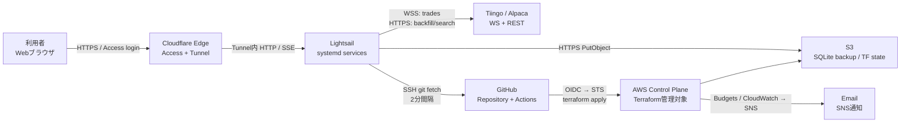
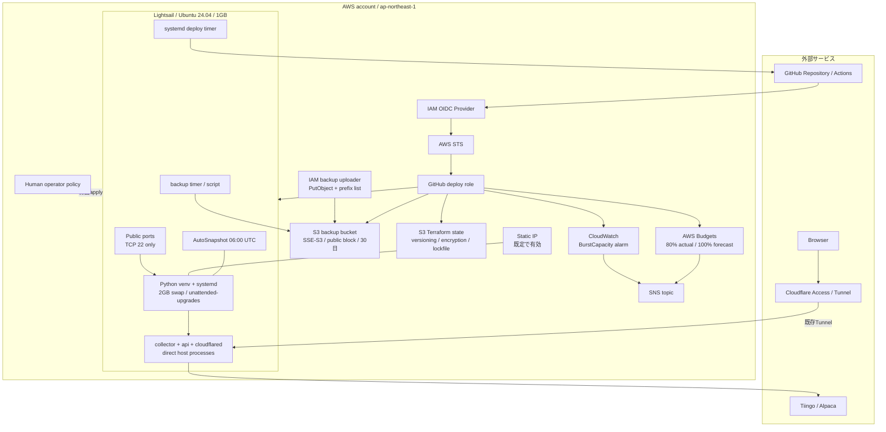
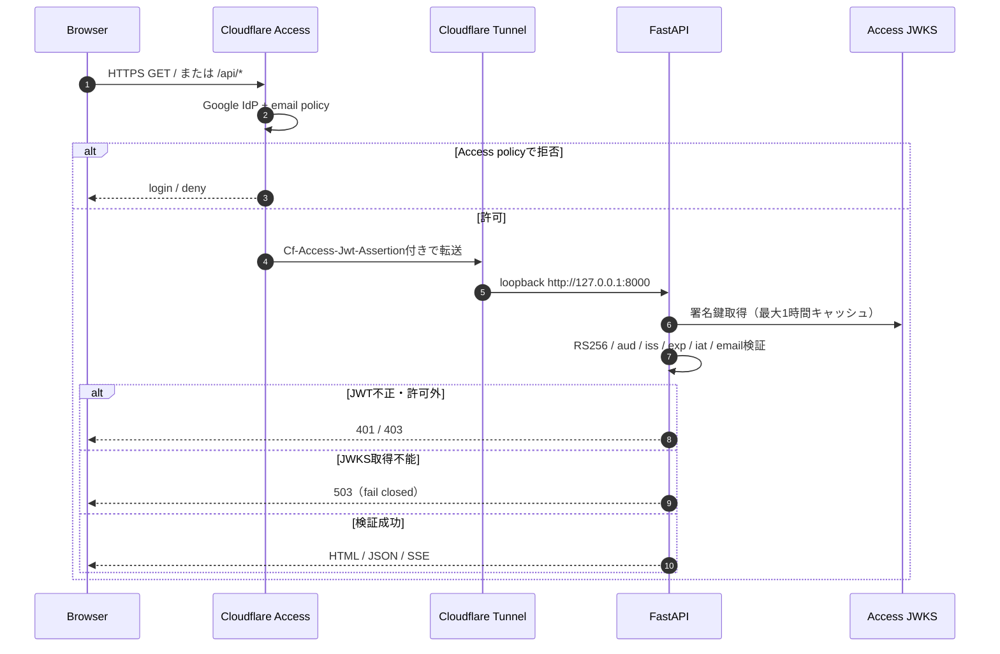
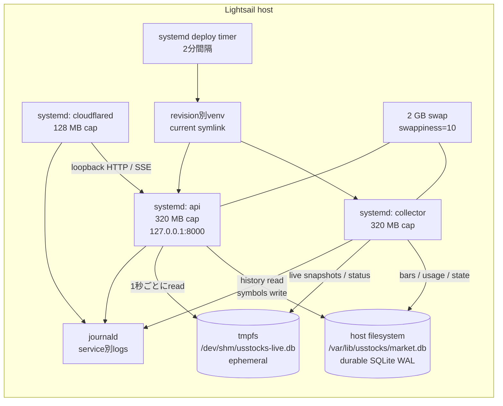
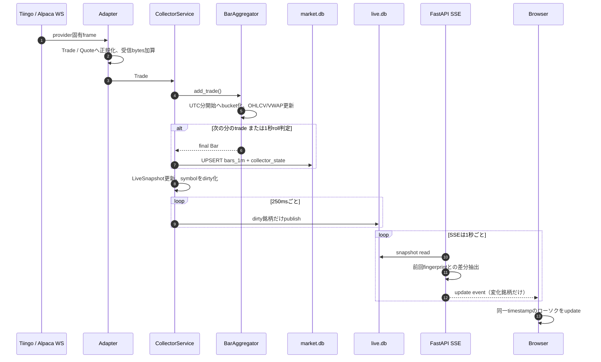
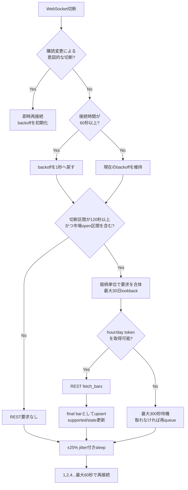
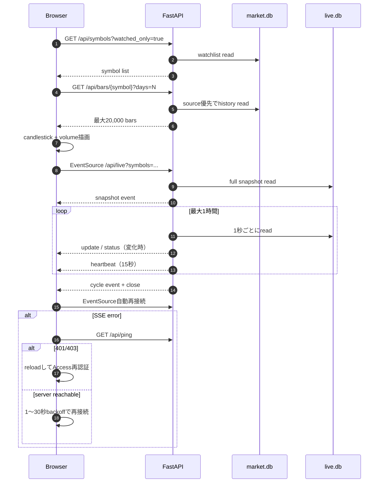
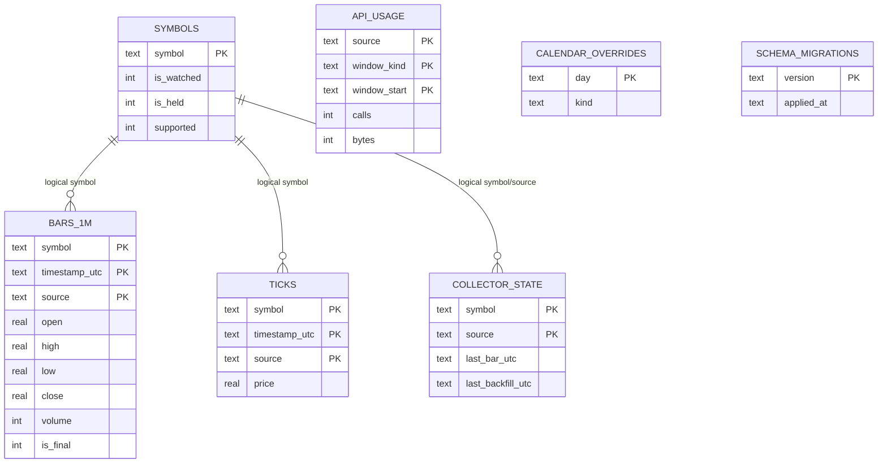
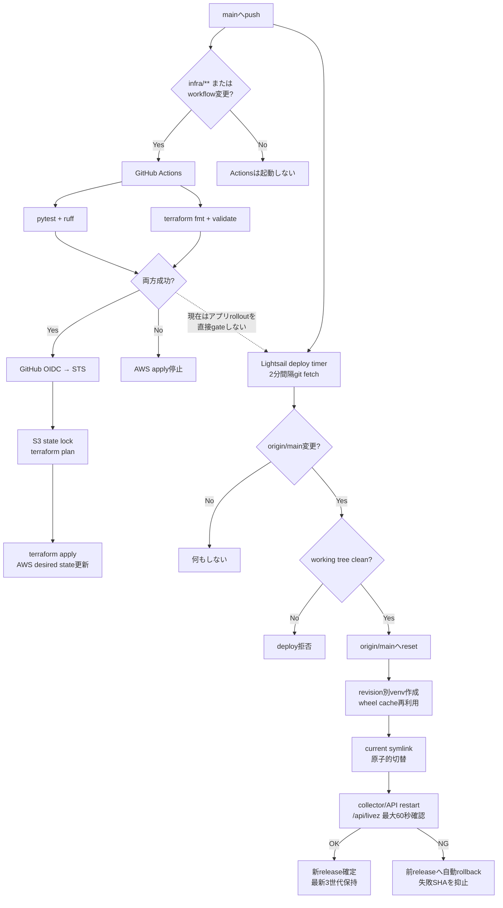
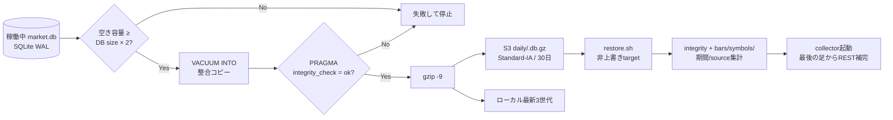

# US Stock Realtime Chart — システム／インフラアーキテクチャ

> 対象リポジトリ: `makechair/us-stock-realtime-chart`
> 調査基準: 2026-07-29 / systemd direct runtime実装時点
> 調査方法: アプリケーション、Docker Compose、systemd、Terraform、GitHub Actions、
> バックアップスクリプトを静的に照合
> 注意: 本書はリポジトリに実装された構成を説明する。AWS／Cloudflare の実環境を
> 参照したものではないため、Terraform 外の手動設定や現在のデプロイ状態は未検証である。

## 1. エグゼクティブサマリー

このシステムは、個人が保有・監視する最大10銘柄の米国株について、約定データから
1分足を生成し、認証済みブラウザへリアルタイム配信する小規模な常時稼働システムである。

中心となる設計判断は次のとおり。

| 観点 | 実装 |
|---|---|
| 市場データ | Tiingo を主系、Alpaca IEX を手動切替の待機系、開発時は Mock |
| 収集 | 独立した Python `asyncio` プロセスが WebSocket を常時購読 |
| 永続化 | SQLite WAL の `market.db`。時系列は collector が単独で書く |
| ライブ共有 | tmpfs 上の別 SQLite `live.db`。collector が書き、API が読む |
| API／画面 | FastAPI + SSE + ビルド不要の静的 JavaScript |
| 外部公開 | Cloudflare Tunnel。Lightsail の 80/443 は公開しない |
| 認証 | Cloudflare Access とアプリ内 JWT 検証の二重ゲート |
| 実行基盤 | Amazon Lightsail 1GB、collector/API/cloudflaredをsystemdで直接起動 |
| IaC | Terraform。Lightsail、S3、IAM、SNS、CloudWatch、Budgets を管理 |
| CI | GitHub Actions でテスト、lint、Terraform validate/apply |
| CD | Lightsail 上の systemd timer が `main` を2分間隔で pull |
| バックアップ | SQLite 整合コピーを gzip 化し、S3 Standard-IA へ日次保管 |

システム全体は「単一ホスト・単一リージョン・単一SQLite」という意図的に小さな構成で、
Redis、メッセージブローカー、ロードバランサー、マネージドDBを追加せず、月額コストと
運用複雑性を抑えている。その代わり、Lightsail インスタンスとローカルDBは単一障害点であり、
復旧は日次バックアップ、Lightsail スナップショット、プロバイダーREST補完を組み合わせる。

## 2. 実装範囲と責任境界

### 2.1 リポジトリで実装されているもの

- Tiingo／Alpaca／Mock の市場データアダプター
- 約定から1分足を生成する collector
- 再接続、指数バックオフ、ジッター、欠損REST補完
- 永続REST利用枠と月間受信帯域メーター
- SQLite スキーマ、マイグレーション、ソース優先解決
- FastAPI の履歴、ライブ、銘柄、CSV／Parquet、ヘルスAPI
- Cloudflare Access JWT のアプリ内検証
- SSE と Lightweight Charts を使う静的フロントエンド
- Docker イメージと3サービスの Compose 構成
- systemd の代替実行ユニット、デプロイtimer、バックアップtimer
- AWS Terraform、GitHub OIDC、CIワークフロー
- 整合バックアップと検証付きリストアスクリプト

### 2.2 リポジトリ外で設定するもの

| 対象 | 設定場所 | コードとの接点 |
|---|---|---|
| Cloudflare Tunnel | Cloudflare Zero Trust | `CLOUDFLARE_TUNNEL_TOKEN` |
| Cloudflare Access アプリ／Google IdP | Cloudflare Zero Trust | team domain、AUD、許可メール |
| DNS hostname | Cloudflare DNS | Tunnel の public hostname |
| Tiingo／Alpaca資格情報 | 各プロバイダー | `/etc/usstocks/usstocks.env` |
| GitHub read-only deploy key | GitHub + Lightsail | deploy agent の SSH fetch |
| S3 uploader access key | AWS IAM + Lightsail | バックアップ専用IAMユーザー |
| SNS email subscription 承認 | 受信メール | Terraform 作成後に手動承認 |
| 初回 Terraform apply | ローカルまたは CloudShell | CI用OIDCロールを作るブートストラップ |

Cloudflare 側の Tunnel／Access は Terraform 管理外である。したがって、AWS の
`terraform apply` が成功しても、外部hostname、Access policy、Tunnel token が正しく
設定されていることまでは保証しない。

## 3. システムコンテキスト



読み方:

1. ブラウザが直接 Lightsail の公開IPへ接続する経路はない。
2. Webトラフィックは Cloudflare Edge で Access 認証され、既存の外向きTunnelを通る。
3. 市場データ取得、コード取得、バックアップ送信もすべてホストからの外向き通信である。
4. GitHub Actions はアプリバイナリをホストへ送らず、AWSの構成だけをTerraformで更新する。

## 4. AWS／ネットワークアーキテクチャ

### 4.1 論理構成



### 4.2 インバウンドとアウトバウンド

| 方向 | 通信 | 用途 | 制御 |
|---|---|---|---|
| inbound | TCP 22 | 管理SSH | `lightsail-connect` alias、または明示CIDRのみ |
| inbound | TCP 80/443 | なし | Terraform の public ports から除外 |
| outbound | Cloudflare Tunnel | Webの公開経路を維持 | `cloudflared` token |
| outbound | WSS | 市場データストリーム | provider API key |
| outbound | HTTPS | REST補完、銘柄検索、JWKS | provider key／公開JWKS |
| outbound | SSH 22 | GitHub private repo の fetch | read-only deploy key |
| outbound | HTTPS | S3へのバックアップ | write-onlyに近いIAM key |
| outbound | HTTPS | OS package／Python依存／AWS CLI取得 | ホストの通常インターネット接続 |

Lightsail は dual-stack のため、Terraform は IPv4 と IPv6 のSSH許可元を別々に
明示する。空リストをそのまま Lightsail API へ渡すと全開放として扱われ得るため、
「許可なし」は `127.0.0.1/32` と `::1/128` の到達不能な番兵値へ変換する。

### 4.3 Webリクエストのセキュリティフロー



アプリは `/api/livez` 以外の静的ファイル、API、SSEを同じミドルウェアで保護する。
Cloudflare 側のポリシーを誤って緩めても、アプリのJWT検証とメールallow-listが
残る。レスポンスには CSP、`X-Frame-Options: DENY`、`nosniff`、
`Referrer-Policy: no-referrer` が付与される。

## 5. Lightsail 上のランタイム



### 5.1 systemdサービス

| サービス | エントリポイント | 責務 | 制限／ヘルス |
|---|---|---|---|
| `usstocks-collector` | `current/venv/bin/python -m usstocks.collector` | WS、集約、補完、時系列書込 | 320MB。15秒heartbeat |
| `usstocks-api` | `current/venv/bin/python -m usstocks.api` | REST、SSE、静的画面、銘柄更新 | 320MB。`/api/livez` |
| `usstocks-cloudflared` | `cloudflared tunnel ...` | 外向きTunnel | 128MB。host port公開なし |

collector と API は同一releaseのvenvから別プロセスとして起動する。release symlinkで
コード世代を揃えつつ、片方だけの再起動もできる。フロントエンドはrelease内の`web/`
から配信され、Node.jsやDocker buildを必要としない。Composeは互換経路として残るが、
同時起動しない。

### 5.2 ストレージ

| ストア | 永続性 | 主な内容 | Writer | Reader |
|---|---|---|---|---|
| `market.db` | `/var/lib/usstocks` | bars、symbols、usage、collector state | collector、APIはsymbolsのみ | API、collector |
| `market.db-wal/-shm` | 同一directory | SQLite WAL | SQLite | SQLite |
| `live.db` | `/dev/shm` tmpfs | 現在値、現在足、collector status | collector | API |
| journald | host disk | service標準出力 | systemd | operator |
| Lightsail snapshot | AWS管理 | whole disk のcrash-consistent copy | Lightsail | recovery |
| S3 backup | off-instance | 検証済み `market-*.db.gz` | backup script | operator |

`live.db` を `market.db` から分離することで、ティックごとの短命な更新が永続DBの
1分足書込と競合せず、SSD書込も抑える。tmpfsを失っても次の約定で再構築される。

## 6. リアルタイム収集フロー



### 6.1 1分足の規則

| 項目 | 実装 |
|---|---|
| 時刻 | UTCの分開始時刻 |
| 入力 | `Trade` のみ。`Quote` は足に混ぜない |
| OHLC | 最初、最大、最小、最後の約定価格 |
| Volume | 非負の約定size合計 |
| VWAP | `Σ(price × size) / Σ(size)` |
| 確定 | 次分の約定、または毎秒のroll判定 |
| 無約定分 | 人工的な足を作らない |
| 遅延約定 | 90秒以内で直前確定足がメモリにあれば再計算しupsert |
| shutdown | 作成中の足をfinalとしてflush |

DBの主キーは `(symbol, timestamp_utc, source)` である。upsertは
「新規がfinal、または既存がnon-final」のときだけ更新するため、再起動直後の
不完全な足で確定足を壊さない。異なるデータソースは別行として共存する。

### 6.2 ソース選択

同一銘柄・同一分に複数ソースの行がある場合、読み出し時に
`USSTOCKS_SOURCE_PRIORITY` の順で1本を選ぶ。既定は Tiingo、Alpaca の順。
各API応答は採用元を含み、期間中にソースが混在すれば画面へ表示する。切替は
`USSTOCKS_PRIMARY_SOURCE` を変えてcollectorを再起動する手動操作で、自動failover
は実装していない。

## 7. 再接続とREST欠損補完



REST利用数は `api_usage` に時間枠・日枠で永続化される。collectorがクラッシュしても
枠がリセットされず、再起動ループで無料枠を使い切らない。WebSocket／RESTの受信
bytes差分も日・月単位で同じテーブルへ記録し、月間予算の80%で警告する。

起動時、購読銘柄追加時、長い切断後に `last_bar_timestamp + 1分` から現在までを
補完する。RESTから得たバーはプロバイダーの確定値として `is_final=true` で保存される。

## 8. ブラウザ／API／SSEフロー



APIは1ワーカーで動作する。SQLiteコネクションはスレッドローカルで、WALにより
複数readerと短時間のwriterを共存させる。APIも `symbols` だけは書き込むため、
「単一writer」は時系列テーブルに限定される。collectorは5秒ごとにwatchlistを読み、
変更があればWebSocketを張り直す。

主要エンドポイント:

| 種別 | パス | データ経路 |
|---|---|---|
| 履歴 | `GET /api/bars/{symbol}` | `market.db` → JSON |
| ライブ | `GET /api/live` | `live.db` → SSE |
| snapshot | `GET /api/live/snapshot` | `live.db` → JSON |
| 銘柄 | `GET/PUT/DELETE /api/symbols` | `market.db.symbols` |
| 検索 | `GET /api/symbols/search` | ローカル優先、不足時provider |
| export | `GET /api/export/csv` | `market.db` → streaming CSV |
| export | `GET /api/export/parquet` | optional pyarrow、メモリ上で生成 |
| health | `GET /api/health` | DB、disk、live status、budget |
| auth probe | `GET /api/ping` | 認証session確認 |
| liveness | `GET /api/livez` | 唯一の無認証パス |

## 9. データベース構成と書込所有権



SQLiteには外部キーを置かず、論理的な関係として扱う。`ticks` は
`USSTOCKS_TICK_RETENTION_DAYS=0` が既定なので通常は空である。

| テーブル | collector | API | 用途 |
|---|---:|---:|---|
| `bars_1m` | write | read | 1分足 |
| `symbols` | read／support更新 | read／write | watchlist |
| `ticks` | optional write/prune | readなし | 秒レベル約定保存 |
| `api_usage` | write/read | health read | REST／帯域budget |
| `collector_state` | write/read | 原則readなし | gap検出 |
| `market_calendar_overrides` | 起動時read | 直接APIなし | 臨時休場 |
| `schema_migrations` | startup | startup | forward-only migration |

## 10. CI/CD とインフラ反映

### 10.1 コード上の実効フロー



重要: infra／workflow変更を含むpushではGitHub Actionsとホストpullが並行して進む。
アプリだけのpushではActionsを起動せずhost pullだけが進む。いずれもdeploy agentは
workflow成功を確認しないため、テスト未実行または失敗したcommitでも`origin/main`に
存在すればアプリへ反映し得る。

### 10.2 GitHub Actions

| イベント | test/lint | Terraform validate | Terraform apply |
|---|---:|---:|---:|
| Pull Request | Yes | Yes | No |
| `main` push（infra／workflow変更） | Yes | Yes | 成功後にYes |
| `main` push（アプリのみ） | No | No | No。host pullだけ |
| manual dispatch `apply=false` | Yes | Yes | No |
| manual dispatch `apply=true` | Yes | Yes | 成功後にYes |

applyはOIDCで短期資格情報を取得する。信頼policyは
`repo:<owner>/<repo>:ref:refs/heads/main` に固定され、PRやforkからは引き受けられない。
Terraform state は事前作成した別S3バケットの `usstocks/terraform.tfstate` に保存し、
S3 native lockfile とworkflow concurrencyで競合を抑える。

### 10.3 Pullデプロイ

deploy agent は次の安全策を持つ。

- `flock` で同時実行を防ぐ
- branchが変化していない場合は再起動しない
- local変更があればdeployを拒否
- private repositoryはread-only deploy keyで取得
- 完成前のreleaseは`.build-*`へ隔離
- `current` symlinkを原子的に切り替える
- collector/APIのactive状態と`/api/livez`を最大30回、2秒間隔で確認
- health失敗時は前releaseへ自動rollback
- 失敗SHAは次のrevisionまで再試行せず、2分ごとの切断ループを防ぐ
- revisionを3世代保持し、pip wheel cacheをrelease間で共有

このpull経路はGitHub Actionsを利用しない。Actionsのquotaを使い切っていても
`main`を取得できる一方、CI成功をrollout条件にはしていない。

## 11. バックアップ／リストア



### 11.1 保護レイヤー

| レイヤー | 整合性 | 主用途 |
|---|---|---|
| SQLite WAL | process crash耐性 | 通常運転 |
| Lightsail AutoSnapshot | crash-consistent whole disk | host／disk復旧 |
| `VACUUM INTO` + integrity check | application-consistent DB | 確実な履歴復旧 |
| provider REST backfill | 市場データ再取得 | backup後の欠損縮小 |

日次timerは07:10 UTC（米国時間のafter-hours後）を意図し、S3は30日保持する。
backup uploaderは `daily/*` への `PutObject` と同prefixのlistだけを持ち、読み戻しや
削除を許可しない。アクセスキー自体はTerraformで作らず、stateへ秘密を残さない。

## 12. 監視と運用シグナル

### 12.1 アプリ内health

`/api/health` は次を集約する。

- API process uptime
- collector statusの更新時刻、接続状態、最終message／trade
- DB size、bar件数、disk使用率
- 月間受信bytesと警告比率
- RESTの時間／日利用数
- backup作成に必要な空き容量

判定:

| 問題 | 条件 | overall |
|---|---|---|
| `collector_status_stale` | statusがない、または60秒超 | `down` / HTTP 503 |
| `collector_disconnected` | statusは新しいが非接続 | `degraded` |
| `bandwidth_budget_high` | 月間budgetの80%以上 | `degraded` |
| `disk_usage_high` | disk 70%以上 | `degraded` |
| `insufficient_headroom_for_backup` | free < DB size × 2 | `degraded` |

### 12.2 基盤監視

- collectorの15秒heartbeatとAPI `/api/livez`
- systemd `Restart=always`: process異常終了から復帰
- systemd deploy timer: pull deploy失敗をjournalへ記録
- CloudWatch: Lightsail `BurstCapacityPercentage < 20%` が15分続けばSNS
- AWS Budgets: actual 80%、forecast 100%でSNS
- journald: unit単位でcollector/API/cloudflaredのlogを保持

現状、collectorの切断、backup失敗、service unhealthyをSNSへ直接送る仕組みは
Terraformにはない。外形監視も `/api/health` が認証必須のため別途必要である。

## 13. 障害時の挙動

| 障害 | 自動挙動 | データ影響／手動対応 |
|---|---|---|
| provider WS切断 | 1〜60秒指数backoff + jitter | 120秒以上のopen区間をREST補完 |
| provider REST枠枯渇 | window更新まで待機、timeout後requeue | 補完完了が遅れる |
| Tiingo長時間障害 | 自動切替なし | operatorがAlpacaへ明示切替 |
| collector crash | systemdが再起動 | 作成中barは未flushの可能性、REST補完 |
| API crash | 独立再起動 | 収集は継続、SSE client再接続 |
| `live.db`消失 | 次のtradeで再構築 | durable historyは無影響 |
| `market.db`破損／host喪失 | snapshotまたはS3からrestore | 起動後にREST補完 |
| Cloudflare Access session失効 | SSE error後 `/api/ping` が401、画面reload | Google再認証 |
| JWKS取得不能 | APIが503 | fail closed。復旧待ち |
| disk逼迫 | health degraded、backupは事前拒否 | 容量確保またはinstance移行 |
| CPU burst枯渇 | CloudWatch → SNS | collector遅延。bundle見直し |
| 新revisionのAPI不健康 | 前releaseへ自動rollback | 失敗SHAを調査し、次revisionで修正 |

## 14. 構成値と秘密情報

### 14.1 主要な既定値

| 設定 | 既定値 |
|---|---:|
| 最大購読銘柄 | 10 |
| REST | 50 calls/hour、1,000 calls/day |
| 月間受信budget | 1,000,000,000 bytes |
| 帯域警告 | 80% |
| 短いgapの補完抑止 | 120秒 |
| 遅延約定の猶予 | 90秒 |
| live.db publish | 250ms |
| collector status heartbeat | 15秒 |
| SSE poll | 1秒 |
| SSE heartbeat | 15秒 |
| SSE最大寿命 | 1時間 |
| 最大history response | 20,000 bars |
| symbol table poll | 5秒 |
| systemd memory cap | collector 320MB / API 320MB / tunnel 128MB |
| live tmpfs | `/dev/shm/usstocks-live.db` |
| host swap | 2GB |
| deploy poll | 2分 |
| backup retention | 30日 |
| monthly AWS budget | 12 USD |

### 14.2 秘密情報の置き場所

本番値は `/etc/usstocks/usstocks.env` に置く。systemdは`EnvironmentFile`として
直接読むためrepo内へのsecret symlinkは不要である。Terraform `user_data` には秘密を
入れず、初回起動時は空のplaceholderだけを作る。GitHub ActionsにはAWS長期キーを
置かずOIDCを使う。

秘密に該当するもの:

- Tiingo API key
- Alpaca API key／secret
- Cloudflare Tunnel token
- Cloudflare Access AUD
- S3 backup uploader access key／secret
- GitHub deploy private key

## 15. 現行実装で確認できた運用上の注意点

### 15.1 アプリrolloutはCI成功でgateされていない

GitHub ActionsのTerraform applyにはtest/lintのgateがあるが、Lightsailのdeploy agentは
`origin/main` の更新だけを見ている。ワークフロー結果との連携、release tag、成功commit marker
はない。アプリのCDをテスト成功後に限定するには、deploy対象を成功済みSHA／tagへ変えるか、
GitHub APIでcheck suite成功を確認する仕組みが必要である。

Actions quota超過中もpull deployは動くが、その間はローカルでtest/lintを通してから
`main`へ反映する必要性がさらに高い。

### 15.2 初回pull agent有効化は手動ブートストラップを要する

Terraform `user_data` はOS、Python、ユーザー、ディレクトリ、env placeholder、
repo URLまでを作るが、private repositoryをcredential付きでcloneしない。最初のcloneと
`deploy/systemd/install.sh`実行はout-of-bandで必要である。これは秘密のdeploy keyを
metadataから読めるuser_dataへ埋め込まないための境界である。

### 15.3 Composeへ戻す場合はDBの再移行が必要

systemd release間のrollbackは自動化されている。一方、Composeとsystemdはdurable DBの
配置が異なるため、runtime自体をComposeへ戻す場合はcollectorを両方停止し、
`/var/lib/usstocks/market.db`をnamed volumeへSQLite online backupで戻す必要がある。
古いCompose volumeをそのまま起動すると、切替後に収集した履歴が欠落する。

### 15.4 監視通知の対象は限定的

TerraformでSNSへ接続されるのはLightsail CPU burstとAWS Budgetsである。backup失敗、
collector stale／disconnect、systemd restart、disk容量はアプリ上で検出またはログ化
されるが、SNS通知へは配線されていない。

### 15.5 system unit変更はinstallerの再実行が必要

通常のPython／web変更はpull agentだけで反映される。`deploy/systemd/*.service`、
installer、deploy service unitを変更した場合は、ホストの`/etc/systemd/system`へ
反映するため`deploy/systemd/install.sh`を再実行する。

## 16. ディレクトリ／コンポーネント対応

```text
.
├── src/usstocks/
│   ├── adapters/          # provider境界、WS/REST正規化
│   ├── collector/         # 集約、再接続、補完、quota、publish
│   ├── api/               # FastAPI、認証、REST、SSE、静的配信
│   ├── db/                # SQLite接続、repository、live store、migration
│   ├── calendar_us.py     # 米国市場日／session判定
│   ├── config.py          # environment設定とfail-fast検証
│   └── models.py          # provider非依存domain model
├── web/                   # build不要のHTML/CSS/JS + vendored chart library
├── deploy/
│   ├── Dockerfile
│   ├── docker-compose.yml
│   ├── agent/             # pull CD用script + systemd timer
│   ├── backup/            # consistent backup / verified restore
│   ├── cloudflared/       # 手動Cloudflare設定のreference
│   └── systemd/           # direct runtime、installer、Tunnel／backup timer
├── infra/
│   ├── terraform/         # AWS desired state
│   └── iam/               # 初回applyを行うhuman operator policy
├── .github/workflows/     # test / validate / terraform apply
├── scripts/               # local dev、seed、state bootstrap、SSH CIDR更新
└── tests/                 # adapter、collector、API、DB、calendar等
```

## 17. トレーサビリティ

| 説明対象 | 主な一次情報 |
|---|---|
| direct runtime／release／health | `deploy/systemd/`, `deploy/agent/deploy-agent.sh` |
| Compose互換経路 | `deploy/docker-compose.yml`, `deploy/Dockerfile` |
| Lightsail／firewall／snapshot | `infra/terraform/lightsail.tf` |
| S3／backup IAM | `infra/terraform/backup.tf` |
| budget／SNS／CloudWatch | `infra/terraform/monitoring.tf` |
| GitHub OIDC権限 | `infra/terraform/github_oidc.tf` |
| CI apply | `.github/workflows/deploy.yml` |
| pull CD | `deploy/agent/deploy-agent.sh` と systemd unit |
| host bootstrap | `infra/terraform/templates/bootstrap.sh.tftpl` |
| backup／restore | `deploy/backup/backup.sh`, `restore.sh` |
| auth boundary | `src/usstocks/api/app.py`, `auth.py` |
| realtime flow | `src/usstocks/collector/service.py`, `aggregator.py` |
| backfill／quota | `backfill.py`, `ratelimit.py` |
| DB schema／ownership | `db/migrations/0001_initial.sql`, `repository.py`, `live_store.py` |
| SSE／browser reconnect | `api/routes/live.py`, `web/app.js` |

## 18. まとめ

このリポジトリは、小規模な個人用途に合わせて、外向き接続中心、二重認証、
単一ホスト、SQLite、pull型CDという一貫した設計を採っている。データ取得から画面までの
経路は短く、provider障害・API再起動・live state消失には局所的に回復できる。

systemd direct runtimeでは、DB／backup path、無取引時heartbeat、revision切替とrollbackを
一貫させた。残る主要な運用課題は、CI成功とアプリrolloutの結合、app-level障害のSNS通知、
Composeから移行する一度だけのDB handoffである。
