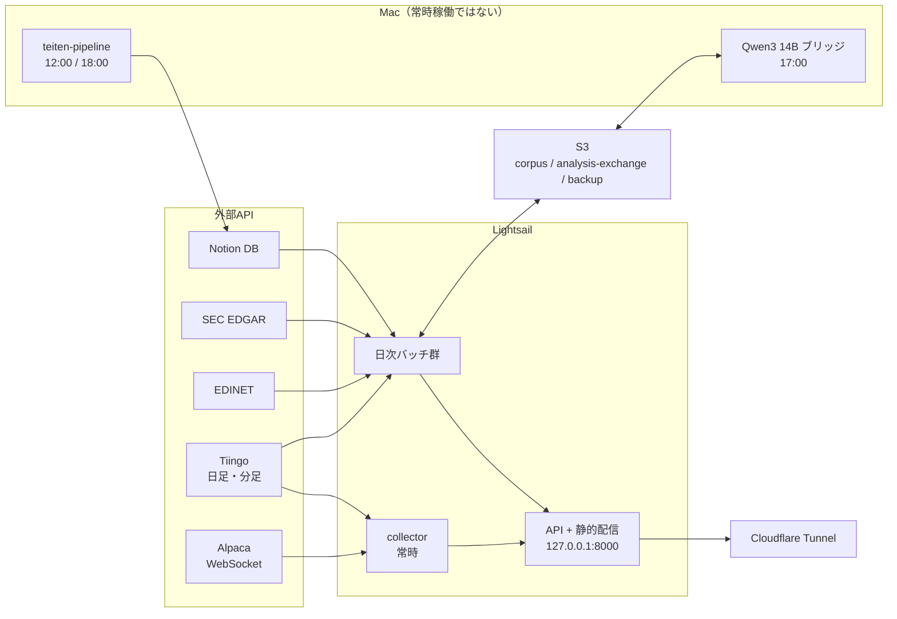
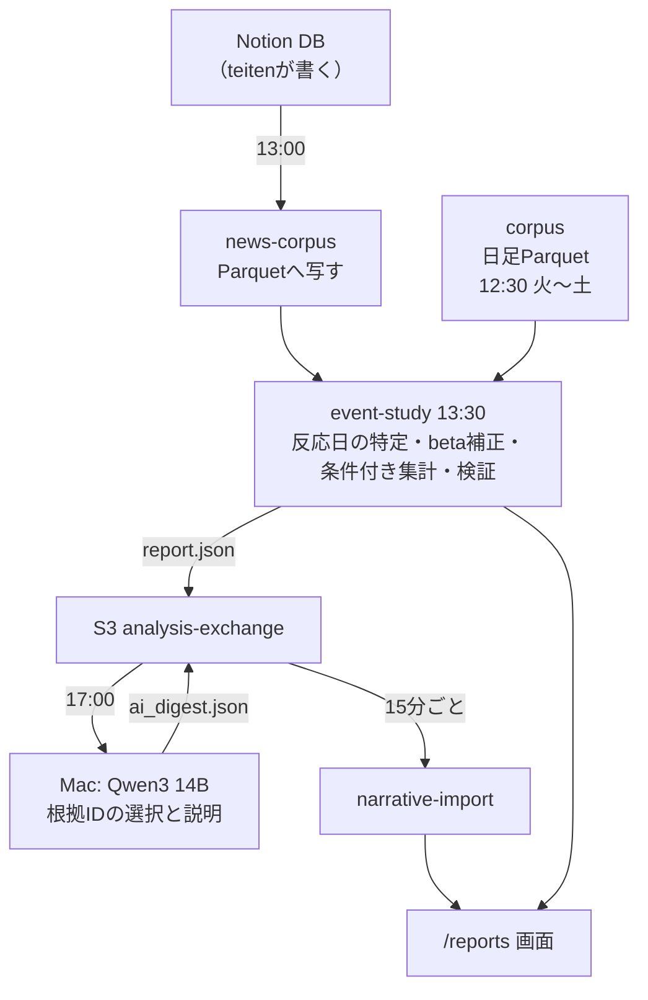
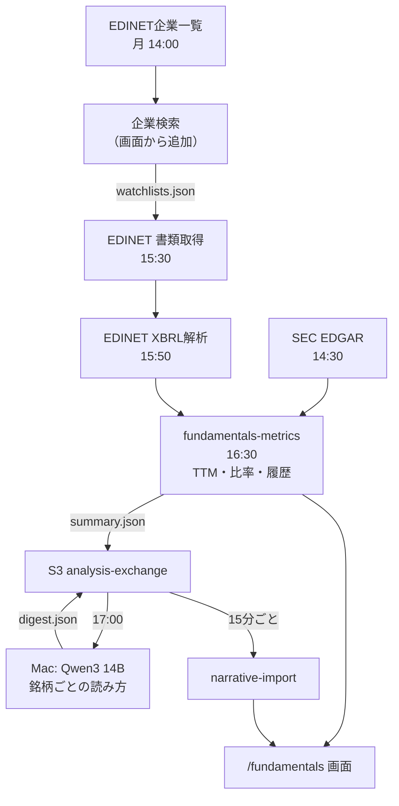

# システム全体図と定期実行の時刻表

このシステムが**どこで何を動かし、いつ走り、どの順で依存しているか**を1枚に
まとめた文書。設計の理由は各仕様書（`analysis-spec.md` / `earnings-spec.md` /
`architecture.md`）にあり、ここは**運用時に見る地図**である。

対象は2026-08-06時点。時刻はすべて**JST**で書く（systemdのunitはUTCで書かれて
いるので、変更するときは+9時間を戻すこと）。

---

## 1. 実行される場所は3つ

| 場所 | 中身 | 常時稼働 |
|---|---|---|
| **Lightsail**（Ubuntu, 1GB） | 収集・API・全バッチ | collector / api / cloudflared |
| **Mac ローカル** | Qwen3 14B（Ollama）による解説生成 | いいえ（launchdで1日1回） |
| **Mac ローカル / teiten-pipeline** | ニュース収集→要約→Notion書き込み | いいえ（1日2回） |

**teiten-pipelineはこのリポジトリに無い**（別リポジトリ、Claude Codeの別会話で
開発）。このシステムから見ると「Notion DBに記事が増える」という**外部の入力**で
ある。

Macが閉じていても、Lightsail側は止まらない。落ちるのは解説文だけで、数値と
画面は生き続ける。これは意図した設計で、ローカルLLMを止められる依存にしない
ためである。



---

## 2. パイプラインは4本

### 2-1. リアルタイム株価（常時）

`collector` が Alpaca WebSocket と Tiingo REST から取り、SQLiteへ書く。
APIはそれをSSEで配信する。

- 正本: `/var/lib/usstocks/market.db`（日足・分足）
- 速報: `/dev/shm/usstocks-live.db`（**tmpfs**。再起動で消えてよい値だけ置く）
- REST予算はTiingoの無料枠（50/時、1,000/日）に合わせて `ratelimit.py` が制御する

### 2-2. ニュース × 株価（イベントスタディ）



**Qwenは数値を計算しない。** fact IDの選択と説明の整理だけを行い、画面に出る
数値はこちら側がJSONからコピーする。ローカルLLMの幻覚が数字に混入しない。

### 2-3. 決算（EDGAR + EDINET）



### 2-4. ユーザーのリストと企業追加

`/var/lib/usstocks/watchlists.json` がAPIの**唯一の書き込み先**。リリースの外に
置いてあるのでデプロイで消えない。追加した企業は `universe_jp.csv` に**足す**形で
EDINETジョブへ渡る。

---

## 3. 定期実行の時刻表（JST）

| 時刻 | unit / 場所 | 内容 | 依存する前工程 |
|---|---|---|---|
| 2分ごと | `usstocks-deploy` | `main` をfetchし、差分があればリリース切替 | — |
| 15分ごと | `usstocks-analysis-narrative-import` | Macが返した解説をS3から取り込む | Mac側の出力 |
| **12:00** | Mac / teiten-pipeline | 記事収集→要約→Notion書き込み | — |
| **12:30**（火〜土） | `usstocks-corpus` | 日足Parquetの更新とS3アップロード | Tiingo |
| **13:00** | `usstocks-news-corpus` | Notion→Parquet | teitenの書き込み |
| **13:30** | `usstocks-event-study` | イベントスタディ一式、`report.json` | corpus / news-corpus |
| **14:00**（月） | `usstocks-edinet-codes` | EDINET企業一覧のミラー | — |
| **14:30** | `usstocks-fundamentals` | EDGAR XBRLの取得 | — |
| **15:30** | `usstocks-edinet` | EDINET書類の取得（遡り90日） | watchlists |
| **15:50** | `usstocks-edinet-facts` | EDINET XBRL→ファクト行 | edinet |
| **16:10** | `usstocks-backup` | SQLiteの整合バックアップをS3へ | — |
| **16:30** | `usstocks-fundamentals-metrics` | 決算指標の算出、`summary.json` | fundamentals **と** edinet-facts |
| **17:00** | Mac / launchd | Qwen3 14Bで解説生成（分析＋決算） | event-study / metrics |
| **17:30**（日） | `usstocks-catalog` | ティッカーカタログの更新 | — |
| **18:00** | Mac / teiten-pipeline | 記事収集（2回目） | — |

`RandomizedDelaySec` が入っているので、実際の開始は表の時刻から最大10分ほど
後ろにずれる。`Persistent=true` なので、インスタンスが止まっていた分は起動後に
1回だけ走る。

### 実行順序の確認方法

```bash
systemctl list-timers 'usstocks-*' --all --no-pager
```

---

## 4. 時刻表から見つかった順序の問題（2026-08-06に修正済み）

時刻表を1枚にした結果、依存関係と時刻の組み合わせだけから読める問題が2つ
見つかった。どちらも**本番ログではなく時刻表からの指摘**だが、構造的に起きる
ものなので直した。

### 4-1. 日本株の決算指標が常に1日遅れていた（修正済み）

`fundamentals-metrics` は14:45、`edinet-facts` は15:50。**指標の算出が、読むはず
のファクトの抽出より前に走っていた。** EDINETのファクトが増えても、指標表に
載るのは翌日である。JP-A2を回した当日に表が変わらなかったとしたら、これが理由に
なり得る。

**→ `fundamentals-metrics` を16:30へ移した。** `edinet-facts`（15:50 + 揺らぎ）
とバックアップ（16:10〜16:20）の両方の後ろになる。unitのコメントに、ここを前へ
戻すと日本株の1日遅れが黙って復活すると書いてある。

### 4-2. Macが読む `summary.json` が前日のものだった（修正済み）

`fundamentals-metrics` のpublishとMacのlaunchdが**どちらも14:45**だった。
サーバー側には `RandomizedDelaySec=300` があるぶん後になりやすく、Macは前日の
ファイルをダウンロードしていた可能性が高い。digestで再処理を止める仕組みが
あるため「同じ内容を2度Qwenに投げる」事故にはならないが、**解説だけ1日古い**
状態が続く。

**→ Macのlaunchdを17:00へ移した。** 分析レポート（13:30）と決算指標（16:30 +
揺らぎ）の両方が出そろった後になる。Mac側の解説は3時間ほど遅くなるが、
1日1回の読み物なので、数字と食い違わないことの方が価値が高い。

### 4-3. 日足は火〜土、イベントスタディは毎日 — これは問題ではない

当初これを「無駄」と書いたが**誤りだった**ので訂正する。

`usstocks-corpus` は火〜土だが `event-study` は毎日走る。日足が増えない日でも
**ニュースは増える**（teitenは毎日12:00と18:00に書き込む）。日曜・月曜の実行は
その週末の記事を取り込み、反応日が決まらないものを未接続として数える。翌営業日の
日足が入った時点で接続される。したがって毎日走らせるのが正しく、火〜土に
揃えると**週末の記事の反映が最大2日遅れる**。

---

## 4-4. イベントスタディが15分で打ち切られていた（2026-08-13に発見）

`usstocks-event-study` は `TimeoutStartSec=900` を持ち、**8月12日と13日の定期実行が
どちらもその上限で殺されていた**（`Consumed 14min 58s CPU`）。待ちではなく計算で
使い切っている。結果として `report.json` が数日間更新されず、**画面はそれを
知らせない** — 前回のレポートがそのまま出続けるだけである。

上限を3600秒へ上げ、あわせて**5秒を超えた文の所要時間をログに出す**ようにした。
15分の失敗が「どの文か」を言わないままだと、対策が推測になる。

この処理は単スレッドでCPU律速で、**履歴の長さに対しておおむね二乗で伸びる**
（各営業日 × 20の買い日 × 20の売り日の組み合わせを作る）。したがって上限は
現在の実行時間のすぐ上ではなく、十分上に置く必要がある。次の実行のログで
どの文が支配的かが分かるので、そこから縮める。

**同種の故障の見つけ方**: `systemctl list-timers` は「最後にいつ発火したか」しか
言わない。**成功したかどうかは別**である。

```bash
systemctl --failed --all | grep usstocks
journalctl -u 'usstocks-*' --since '3 days ago' --no-pager | grep -i "timed out\|Failed"
```

---

## 5. ストレージの配置

```
/var/lib/usstocks/                 # 永続。デプロイで消えない
  market.db                        # 日足・分足の正本
  watchlists.json                  # ユーザーのリストと追加企業
  corpus/                          # 各ジョブのローカル作業用ミラー
    daily/symbol=NVDA/part.parquet
    news/date=2026-08-06/part.parquet
    fundamentals/symbol=MU/part.parquet
    fundamentals_metrics/part.parquet
    fundamentals/summary.json      # 決算画面が読む唯一のファイル
    edinet/code=8035/<docID>/      # 書類のZIPとPDF（原本のまま）
    edinet_codes/companies.json    # 企業検索の元
    analysis/latest/report.json    # 分析レポート
    universe/sectors.parquet       # 米国
    universe/sectors_jp.parquet    # 日本
  *-state.json                     # 各ジョブの冪等性のための状態

/dev/shm/usstocks-live.db          # 速報。再起動で消えてよい

/opt/usstocks/
  app/                             # deploy-agentがfetchするチェックアウト
  releases/<sha>/                  # venv + web + data + スクリプト2本のみ
  current -> releases/<sha>        # 原子的に切り替わるsymlink
```

**リリースには `deploy/` が入らない。** systemd unitを更新するときの参照先は
`/opt/usstocks/app/deploy/systemd/` であって `current` ではない。

**unitはデプロイでは入らない。** deploy-agentはvenvとwebを差し替えるだけなので、
新しいunitを足したときは手で入れるか `install.sh` を通す必要がある。入れ忘れると
**timerだけあってserviceが無い**状態になり、`Refusing to start, unit ... to
trigger not loaded` で静かに発火しなくなる（2026-08-07に
`usstocks-fundamentals-metrics.service` がこの状態だった。timerは登録済みだったが
一度も動いておらず、指標は手動実行のぶんしか更新されていなかった）。

`ls -l /etc/systemd/system/usstocks-*` で **.service と .timer が対で揃っているか**
を見るのが、この故障を見つける唯一の確実な方法である。

```bash
# globはsudoの前のシェルが展開する。/opt/usstocks は 0750 なので ubuntu では
# 展開できず、リテラルのまま渡って cannot stat になる。root側で展開させる。
sudo bash -c 'install -m 0644 /opt/usstocks/app/deploy/systemd/usstocks-*.{service,timer} /etc/systemd/system/'
sudo systemctl daemon-reload
```

S3側は `corpus/`（コーパス本体）、`analysis-exchange/`（Macとの受け渡し）、
バックアップの3系統。`analysis-exchange` はMac用IAMユーザーの権限が
`input/latest/*` の読取と `output/*` の書込だけに絞ってある。

---

## 6. 冪等性の作り方

全バッチが**同じ2つの手段**で二重実行に耐える。

1. **状態ファイル**（`*-state.json`）に、取得済みのIDや処理済みのdigestを持つ。
   EDINETはdocID、EDGARはaccession、Notionはpage_idとlast_edited。
2. **内容のdigestが変わらなければS3へ再送しない。** EDGARは毎回全期間を返すので、
   これが無いと毎日全量転送になる。

したがって**手で同じジョブを2回叩いても壊れない**。逆に「実行したのに何も
変わらない」ときは、たいてい正しくスキップされている。

---

## 7. 手で回すときの入口

すべて `/var/lib/usstocks` をCWDにし、`usstocks` ユーザーで実行する。CWDが要る
のは `.env` の解決が相対パスだからで、ユーザーを合わせるのは書き込むファイルの
所有者を揃えるためである。

```bash
run() {
  sudo bash -c "cd /var/lib/usstocks && set -a; . /etc/usstocks/usstocks.env; set +a; \
    USSTOCKS_CORPUS_LOCAL_DIR=/var/lib/usstocks/corpus \
    USSTOCKS_UNIVERSE_JP_PATH=/opt/usstocks/current/data/universe_jp.csv \
    USSTOCKS_CORPUS_UNIVERSE_PATH=/opt/usstocks/current/data/universe.csv \
    USSTOCKS_WATCHLISTS_PATH=/var/lib/usstocks/watchlists.json \
    runuser -u usstocks -- /opt/usstocks/current/venv/bin/python -m usstocks.corpus.$1 ${*:2}"
}
run daily              # 日足
run news               # Notion取り込み
run event_study        # 分析レポート
run fundamentals       # EDGAR
run edinet             # EDINET書類（--since 2023-04-01 で遡り）
run edinet_facts       # EDINET XBRL解析
run edinet_codes       # 企業一覧のミラー
run fundamentals_metrics
```

systemd経由なら `sudo systemctl start usstocks-<name>.service`。環境変数は
unitが持っているので、こちらの方が本番の実行条件と一致する。**手打ちのときだけ
環境変数を自分で並べる必要がある**点に注意（過去に `USSTOCKS_UNIVERSE_JP_PATH`
の付け忘れで落ちたことがある）。

---

## 8. 画面と、その裏にあるファイル

| 画面 | 読むファイル | 更新するジョブ |
|---|---|---|
| `/` チャート | SQLite（SSE） | collector（常時） |
| `/reports` 分析レポート | `analysis/latest/report.json` | event-study 13:30 |
| `/fundamentals` 決算分析 | `fundamentals/summary.json` + `digest.json` | metrics 16:30 |
| `/coverage` 蓄積状況 | SQLite | collector |

APIは**計算をしない**。DuckDBもpyarrowもAPIプロセスには入れていない（1GBの
インスタンスでメモリを使い切るため）。画面が古いときは、APIではなく**その裏の
ジョブ**を見る。
