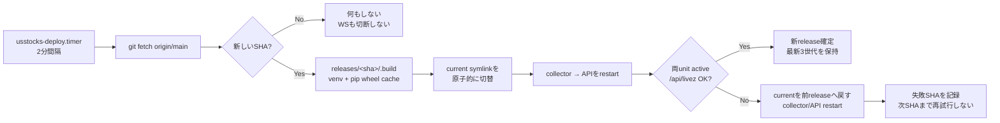

# LightsailをDocker buildなしで運用する

この構成では、collectorとAPIをsystemdで直接起動する。アプリ更新はLightsailが
GitHubの`main`をpullし、revisionごとのPython venvを作って切り替える。GitHub
Actions runner上でもLightsail上でもDocker image buildは行わない。

Cloudflare Tunnelもホスト版`cloudflared`をsystemdで動かせば、安定稼働を確認した
後にDocker daemon自体を停止できる。Compose構成は削除せず、移行時の退避経路として残す。

## 1. このアプリでの性能評価

Linux container内のPythonはネイティブ実行なので、systemd化だけでcollectorの
JSON処理やSQLiteが何倍も速くなるわけではない。市場データの待ち時間は主にprovider
までのWAN、受信後はJSON decode、1分足集約、SQLite WAL書込で決まる。

一方、Lightsail 1GBでは次の差が効く。

| 項目 | Compose | systemd直接起動 |
|---|---|---|
| collector/API実行速度 | Linux上のネイティブPython | 同じ |
| APIまでのTunnel経路 | container bridgeを1回通る | loopback |
| 常駐オーバーヘッド | Docker daemon、container shim、log driver | systemd管理分のみ |
| 更新時 | image buildとlayer展開 | venv作成、wheel cacheからinstall |
| コードrollback | image/tagを手動で戻す | symlinkを前releaseへ自動で戻す |
| 分離 | namespace/cgroup | systemd cgroup/hardening |

したがって主目的は「通信スループットの大幅向上」ではなく、平常時メモリと更新時CPU／
disk I/Oの余白を増やし、CPU burst creditを市場時間中のcollectorへ残すことである。
通信頻度が高いほど重要なのは、次のアプリ側の抑制である。

- providerはtradeだけを購読し、quoteをOHLCVへ混ぜない
- live snapshotを0.25秒単位でまとめ、tickごとにSQLiteへ書かない
- `live.db`をtmpfsへ置き、SSDへの高頻度書込を避ける
- 1分足の永続DBはWALを使い、時系列のwriterをcollectorに集約する
- collector heartbeatは15秒間隔にし、休場中のfalse staleを防ぎつつ書込を増やさない

## 2. release構成



サーバー上の配置は次のとおり。

```text
/opt/usstocks/
├── app/                         # pull対象のGit working tree
├── current -> releases/<sha>/   # 稼働releaseへのsymlink
└── releases/
    ├── <current-sha>/
    │   ├── venv/
    │   ├── web/
    │   ├── backup.sh
    │   └── REVISION
    └── <previous-sha>/          # rollback用

/var/lib/usstocks/market.db      # 永続データ
/dev/shm/usstocks-live.db        # 再生成可能なlive state
/var/cache/usstocks/pip/         # revision間で共有するwheel cache
/etc/usstocks/usstocks.env       # secret。Git管理外
```

releaseは完成するまで`.build-*`に作り、完成後だけ`current`を`rename(2)`相当で
切り替える。pip buildは`usstocks`ユーザーで行い、完成後のreleaseはroot所有・
書込不可にする。実行プロセスも`usstocks`ユーザーであり、rootではない。

rollbackの対象はコードと静的ファイルであり、SQLite migrationを巻き戻すものではない。
migrationは既存コードと後方互換になるよう加算的に設計する。破壊的schema変更を行う
場合は、自動deploy対象にせず、事前backupと明示的なmaintenance手順を用意する。

## 3. 既存Composeからの切替

### 3.1 事前準備

既存インスタンスのTerraform `user_data`は更新しても再実行されない。必要なpackageを
明示的に追加する。

```bash
sudo apt-get update
sudo apt-get install -y python3 python3-venv
python3 --version                    # 3.11以上
```

Cloudflare公式手順でhost版`cloudflared`を入れ、次を確認する。

```bash
command -v cloudflared               # /usr/bin/cloudflared
cloudflared --version
```

`/etc/usstocks/usstocks.env`は少なくとも次を含める。DBとAPI bindはunitでも固定して
いるが、運用者が見たときに配置が明確になるようenvにも記録しておく。

```ini
USSTOCKS_DB_PATH=/var/lib/usstocks/market.db
USSTOCKS_LIVE_DB_PATH=/dev/shm/usstocks-live.db
USSTOCKS_API_HOST=127.0.0.1
CLOUDFLARE_TUNNEL_TOKEN=<既存のTunnel token>
```

### 3.2 market.dbの一度だけの移行

collectorを2つ同時に動かしてはいけない。同じprovider streamを二重購読し、別DBへ
履歴が分岐するためである。まず自動deployを止め、Compose全体を停止する。

```bash
cd /opt/usstocks/app
sudo systemctl stop usstocks-deploy.timer 2>/dev/null || true
docker compose -f deploy/docker-compose.yml stop
```

named volumeの実体を確認し、systemd用の場所へSQLiteの整合コピーを作る。既存の
`/var/lib/usstocks/market.db`は上書きしない。

```bash
SOURCE_DIR=$(docker volume inspect usstocks_market-data --format '{{.Mountpoint}}')
sudo test -f "${SOURCE_DIR}/market.db"
sudo test ! -e /var/lib/usstocks/market.db
sudo install -d -o usstocks -g usstocks -m 0750 /var/lib/usstocks
sudo sqlite3 "${SOURCE_DIR}/market.db" \
  ".backup '/var/lib/usstocks/market.db.migrating'"
sudo sqlite3 /var/lib/usstocks/market.db.migrating 'PRAGMA integrity_check;'
# 出力が ok の場合だけ確定する
sudo mv /var/lib/usstocks/market.db.migrating /var/lib/usstocks/market.db
sudo chown usstocks:usstocks /var/lib/usstocks/market.db
sudo chmod 0640 /var/lib/usstocks/market.db
```

`live.db`は次のtradeから再構築されるためコピーしない。

### 3.3 unitと初回releaseの導入

```bash
cd /opt/usstocks/app
sudo ./deploy/systemd/install.sh /opt/usstocks/app
```

installerは以下を行う。

1. Composeのcollector/APIがまだ動いていないことを確認
2. Python、env、service account、DB移行漏れを確認
3. unitを`/etc/systemd/system`へ配置
4. pull deployを1回実行して最初のreleaseを作成
5. collector、API、backup timer、deploy timerを有効化
6. `cloudflared`が導入済みならTunnel unitも起動

確認する。

```bash
systemctl status usstocks-collector usstocks-api usstocks-cloudflared
curl -fsS http://127.0.0.1:8000/api/livez
journalctl -u usstocks-collector -u usstocks-api --since -10min
readlink -f /opt/usstocks/current

# 初回の監視銘柄登録
sudo -u usstocks /usr/bin/env \
  USSTOCKS_DB_PATH=/var/lib/usstocks/market.db \
  /opt/usstocks/current/venv/bin/python /opt/usstocks/app/scripts/seed.py AAPL MSFT
```

外部hostnameでAccess認証、履歴表示、live更新まで確認する。最低1市場日を安定運用した
後、volumeは消さずにDockerだけ停止・無効化すればメモリを回収できる。

```bash
sudo systemctl disable --now docker.service docker.socket
```

`docker compose down -v`や`docker volume rm`は実行しない。旧`market.db`を残せば、
移行直後の調査材料になる。

## 4. 日常運用

アプリのpush deployは不要である。`main`へ反映された後、Lightsailが最大約2分で
検出する。このpull処理はGitHub Actionsの実行時間やartifact容量を消費しない。

```bash
# deploy結果と現在revision
journalctl -u usstocks-deploy.service --since today
readlink -f /opt/usstocks/current

# プロセス単位の現在メモリ、CPU時間、再起動回数
systemctl show usstocks-collector usstocks-api \
  -p ActiveState -p SubState -p MemoryCurrent -p CPUUsageNSec -p NRestarts

# cgroup別のリアルタイム負荷
systemd-cgtop

# DB、WAL、disk
ls -lh /var/lib/usstocks/market.db*
df -h /var/lib/usstocks
```

systemd unitやinstaller自体を変更したrevisionでは、自動アプリdeployの完了後に
次を再実行する。通常のPython／web変更では不要である。

```bash
sudo /opt/usstocks/app/deploy/systemd/install.sh /opt/usstocks/app
```

失敗SHAは`/opt/usstocks/failed-systemd-sha`へ記録され、2分ごとの再起動ループを
避ける。同じSHAを手動で再試行する場合は、原因を修正した後にmarkerを削除してserviceを
起動する。

```bash
sudo rm /opt/usstocks/failed-systemd-sha
sudo systemctl start usstocks-deploy.service
```

## 5. 切替後の性能判定

感覚ではなく、市場時間中に少なくとも1時間計測する。

| 観測値 | 良好の目安 | 次の対応 |
|---|---|---|
| collector `NRestarts` | 増えない | journalとprovider切断理由を確認 |
| `MemoryCurrent` | cap 320MBに十分な余裕 | leakなら原因調査、恒常的なら2GB |
| Lightsail CPU burst capacity | 20%を長時間割らない | 銘柄数／tick保存を削減、または2GB |
| `/api/health` status age | 120秒未満 | heartbeat、live tmpfs、collectorを確認 |
| 月間受信bytes予測 | provider契約枠内 | 銘柄数か購読event種別を削減 |
| WAL／disk増加 | 想定した1分足ペース | tick retentionとbackup空き容量を確認 |

systemd化後もCPU burstが減り続ける場合、Docker overheadよりmarket event処理自体が
支配的である。その場合の費用対効果が高い順は、`USSTOCKS_MAX_SYMBOLS`削減、
tick保存無効の確認、不要なquote購読停止、2GB bundleへの変更である。RedisやRDSの
追加は、この単一ユーザー・最大10銘柄の構成ではコスト増に対する効果が小さい。
